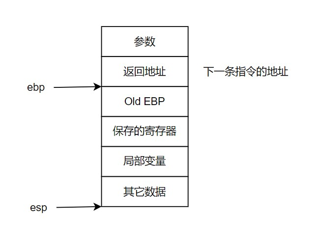

在[linux 内存消耗](http://kcmetercec.top/2018/06/17/linux_memory_overview_consume/)中有内存的布局全局视野，现在还需要再深入理解一下。

<!--more-->

# 程序的内存布局
下图就展示了 32 位系统中**虚拟内存**的典型布局。


上图中的，`Read/write data`区域便对应着应用程序的`.data,.bss`这些段，而`Read only code and data`便对应着`.init,.rodata,.text`这些段。

# 栈与调用惯例

## 什么是栈

栈（stack）是一个特殊的容器，用户可以将数据入栈（push），也可以将入栈的数据出栈（pop），并且数据的顺序是先入后出。

栈保存了一个函数调用所需要的维护信息，这常常被称为堆栈帧（Stack Frame）或活动记录（Activate Record）。堆栈帧一般包括如下几方面的内容：

- 函数的返回地址和参数
- 临时变量：包括函数的非静态局部变量以及编译器自动生成的其它临时变量。
- 保存的上下文：包括在函数调用前后需要保持不变的寄存器

一个 i386 下的函数总是这样调用的：

- 把所有或一部分参数压入栈中，如果有其它参数没有入栈，那么使用某些特定的寄存器传递
- 把当前指令的下一条指令的地址压入栈中
- 跳转到函数体执行
- push ebp：把 ebp 压入栈中（称为 old ebp）
- mov ebp,esp：ebp = esp（这时 ebp 指向栈顶，而此时栈顶就是 old ebp）
- 【可选】sub esp,XXX：在栈上分配 XXX 字节的临时空间
- 【可选】push XXX：如有必要，保存名为 XXX 寄存器（可重复多个，这些寄存器用于保存上级调用的环境）

返回函数时：

- 【可选】pop XXX：如有必要，恢复保存过的寄存器（可重复多个）
- mov esp,ebp：恢复 ESP 同时回收局部变量空间
- pop ebp：从栈中恢复保存的 ebp 的值
- ret：从栈中取得返回地址，并跳转到该位置



## 调用惯例

调用惯例（Calling Convention）用于规定调用方和被调用方遵守同样的约定：

- 函数参数的传递顺序和方式：是仅以压栈的方式传递参数，还是可以使用寄存器来传递参数，而且还有将参数压栈的顺序。
- 栈的维护方式：函数调用完毕后需要将压入栈中的参数弹出以恢复环境，这个可以由调用方完成，也可以由函数本身来完成。
- 名字修饰（Name-mangling）的策略：也就是对函数名字的修饰

c 语言的调用惯例比较统一，而 c++ 则各不相同，所以使用 c 来作为接口可以最大的保持 ABI 的一致性。

c 的调用惯例如下表：

| 调用惯例      | 出栈方     | 参数传递                                                     | 名字修饰                     |
| ------------- | ---------- | ------------------------------------------------------------ | ---------------------------- |
| cdecl（默认） | 函数调用方 | 从右至左的顺序压参数入栈                                     | 下划线+函数名                |
| stdcall       | 函数本身   | 从右至左的顺序压参数入栈                                     | 下划线+函数名+@+参数的字节数 |
| fastcasll     | 函数本身   | 头两个 DWORD(4 字节)类型或者占更少字节的参数被放入寄存器，其他剩下的参数按从右到左的顺序压入栈 | @+函数名+@+参数的字节数      |
| pascal        | 函数本身   | 从左至右的顺序压参数入栈                                     | 较为复杂，参见 pascal 文档   |

## 函数返回值传递

对于返回的值占用内存很小（比如 4 字节）时，通过寄存器存储此值并拷贝给返回的接受对象。

当返回的值占用内存大时：

- 编译器会在栈上开辟一个空间用于存储返回对象
- 首先是函数内对象将内存拷贝到栈上
- 然后函数返回时，再将栈上的内存拷贝到返回的接受对象

可以看到这里使用了两次拷贝，所以尽量使用传指针/引用的方式来传递大内存对象。

# 堆与内存管理

## 什么是堆

堆用于程序可以请求一块连续的虚拟内存，并自由的使用。

## Linux 进程堆管理

[之前](http://kcmetercec.top/2018/06/14/linux_memory_overview_allocAndFree/#org01469fe)就已经了解过：

> 在 **用户空间** 中 glibc 库通过 `brk,mmap` 将buddy的内存进行了二次管理，提供给用户函数 `malloc,free` 使用

```c
#include <unistd.h>

//指定数据段的结束地址，结束地址越高意味着该进程可以使用的堆空间就越大
int brk(void *addr);
//堆进程的数据段进行相对的增大或减小，返回修改后的数据段地址。
//这是堆 brk 函数的封装
void *sbrk(intptr_t increment);
```

```c
#include <sys/mman.h>
//可以向内核申请一块内存映射到匿名页面，这些页面可以作为堆空间
void *mmap(void *addr, size_t length, int prot, int flags, int fd, off_t offset);
//取消映射
int munmap(void *addr, size_t length);
```

**堆分配算法**：

- 空闲链表（Free List）：在每块空闲堆中头或尾存储链表节点以及描述该堆的大小，每次申请和释放都修改链表节点。
- 位图（Bitmap）：将整个堆划分位大量的块，每个块的大小相同。请求内存时，分配整数块个空间。在位图中，第一个被分配的块为头（Head），其余已分配块为主体（Body），未分配的块为空闲（Free）。这就如同文件系统的元数据和 block 一样。

- 对象池：预先申请固定大小的块，待用户要使用时，直接返回给用户。


