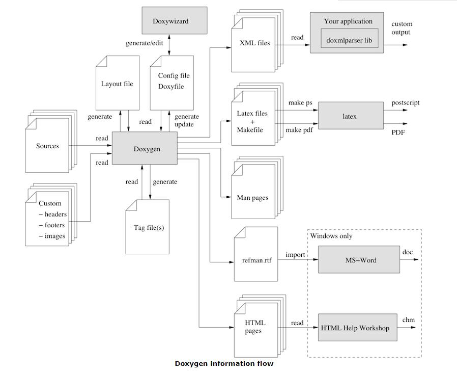

<!--more-->

# 安装
unix 下安装：

``` shell
git clone http://github.com/doxygen/doxygen.git
cd doxygen
mkdir build
cd build
cmake -G "Unix Makefiles" ..
make 
sudo make install
```

# 使用
## 生成配置文件
``` shell
doxygen -g <config-file-name>
```
当不显示的输入文件名时， 默认的文件名为 `Doxyfile`。

然后根据自己工程的情况配置此配置文件.
## 生成说明文档
```
doxygen <config-file-name>
```
## 模板
``` C
/*! \file structcmd.h
    \brief A Documented file.
    
    Details.
*/
 
/*! \def MAX(a,b)
    \brief A macro that returns the maximum of \a a and \a b.
   
    Details.
*/
 
/*! \var typedef unsigned int UINT32
    \brief A type definition for a .
    
    Details.
*/
 
/*! \var int errno
    \brief Contains the last error code.
 
    \warning Not thread safe!
*/
 
/*! \fn int open(const char *pathname,int flags)
    \brief Opens a file descriptor.
 
    \param pathname The name of the descriptor.
    \param flags Opening flags.
*/
 
/*! \fn int close(int fd)
    \brief Closes the file descriptor \a fd.
    \param fd The descriptor to close.
*/
 
/*! \fn size_t write(int fd,const char *buf, size_t count)
    \brief Writes \a count bytes from \a buf to the filedescriptor \a fd.
    \param fd The descriptor to write to.
    \param buf The data buffer to write.
    \param count The number of bytes to write.
*/
 
/*! \fn int read(int fd,char *buf,size_t count)
    \brief Read bytes from a file descriptor.
    \param fd The descriptor to read from.
    \param buf The buffer to read into.
    \param count The number of bytes to read.
*/
 
#define MAX(a,b) (((a)>(b))?(a):(b))
typedef unsigned int UINT32;
int errno;
int open(const char *,int);
int close(int);
size_t write(int,const char *, size_t);
int read(int,char *,size_t);
```
# c-like language 注释规则
> 这里的 c-like 指的是： C/C++/C#/Objective-C/PHP/Java

## 多行注释
具有两种格式，**注意与注释框之间的空格**。

Javadoc 风格：
``` c
/**
 * ... text ...
 */
```

Qt 风格：
``` c
/*!
 * ... text ...
 */
```
## 单行注释
具有两种格式，**注意空格**。
``` c
/// ... text ...
```
```c
//! ... text ...
```

## 注释内容

###  \brief (摘要, 一个简要说明)
在`\brief`之后，只要没有空白换行，都会被解析为摘要。
``` c
/*! \brief Brief description.
 *         Brief description continued.
 *
 *  Detailed description starts here.
 */
```
如果想把某个变量、枚举等加入注释块中，需要附加 `<` 标志：
``` c
int var; //!< Detailed description after the member
```
关于上面的一个示例：
``` c
//!  A test class. 
/*!
  A more elaborate class description.
*/
 
class QTstyle_Test
{
  public:
 
    //! An enum.
    /*! More detailed enum description. */
    enum TEnum { 
                 TVal1, /*!< Enum value TVal1. */  
                 TVal2, /*!< Enum value TVal2. */  
                 TVal3  /*!< Enum value TVal3. */  
               } 
         //! Enum pointer.
         /*! Details. */
         *enumPtr, 
         //! Enum variable.
         /*! Details. */
         enumVar;  
    
    //! A constructor.
    /*!
      A more elaborate description of the constructor.
    */
    QTstyle_Test();
 
    //! A destructor.
    /*!
      A more elaborate description of the destructor.
    */
   ~QTstyle_Test();
    
    //! A normal member taking two arguments and returning an integer value.
    /*!
      \param a an integer argument.
      \param s a constant character pointer.
      \return The test results
      \sa QTstyle_Test(), ~QTstyle_Test(), testMeToo() and publicVar()
    */
    int testMe(int a,const char *s);
       
    //! A pure virtual member.
    /*!
      \sa testMe()
      \param c1 the first argument.
      \param c2 the second argument.
    */
    virtual void testMeToo(char c1,char c2) = 0;
   
    //! A public variable.
    /*!
      Details.
    */
    int publicVar;
       
    //! A function variable.
    /*!
      Details.
    */
    int (*handler)(int a,int b);
};
```

### 其他注释
其他注释的使用方式直接参考[官方手册](https://www.doxygen.nl/manual/commands.html)即可。

# 使用 Markdown 来注释

doxygen 对 Markdown 支持比较完整，可以查看[这个页面](https://www.doxygen.nl/manual/markdown.html)。

只是有一些需要单独说明一下：

- doxygen 可以解析单独的 `.md`文件，如果想将此文件作为文档主页可以为其添加`mainpage`标签：

```markdown
My Main Page                         {#mainpage}
============

Documentation that will appear on the main page
```

