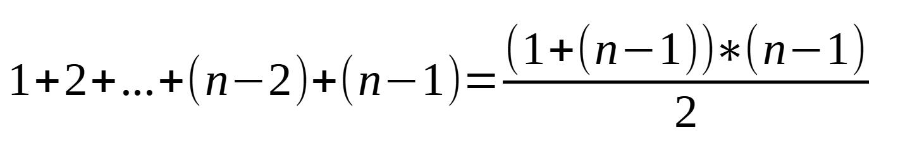

- 学习书籍：[Algorithms 4th Edition](https://algs4.cs.princeton.edu/home/)

我们在编写一段代码时，在需要其频繁运行或处理一大堆数据时，总会有一些疑问：

1. 这段代码的单次运行时间有多长，能否再优化？
2. 这段代码会占用多少内存，是否会触发 Stack overflow 或 Out of memory？

如果仅仅是凭感觉来估算，真实解决往往是大相径庭，我们需要科学方法来量化代码的时间及空间复杂度。

> 实际上，代码的准确执行时间是无法计算的，这根据运行的软硬件环境都有关系。
> 但是不管环境如何，其趋势是可预测的。

<!--more-->

# 科学方法

## 观察

分析一段代码的运行时间，那么就需要一定数量的样本输入，多个样本的输入对应多个运行时间，最后就可以画出一条曲线。

### 测试代码

按照书籍上的代码来依次分析示例文件中的整数：

```java
import edu.princeton.cs.algs4.In;
import edu.princeton.cs.algs4.Stopwatch;

public class Hello {
    public static int count(int[] a) {
        int n = a.length;
        int count = 0;

        for (int i = 0; i < n; ++i) {
            for (int j = i + 1; j < n; ++j) {
                for (int k = j + 1; k < n; ++k) {
                    if (a[i] + a[j] + a[k] == 0) {
                        count += 1;
                    }
                }
            }
        }

        return count;
    }

    public static void main(String[] args) {
        System.out.println("working directory: " + System.getProperty("user.dir"));
        if (args.length == 0) {
            return;
        }

        System.out.println("analyze file: " + args[0]);

        In in = new In(args[0]);
        int[] a = in.readAllInts();

        Stopwatch timer = new Stopwatch();
        int count = count(a);
        System.out.println("elapsed time = " + timer.elapsedTime());
        System.out.println("count = " + count);
    }
}
```

测试文件与对应的输出时间关系如下表：

| 文件名称        | 数量      | 执行时间(秒)  |
| ----------- | ------- | -------- |
| 1Kints.txt  | 1000    | 0.159    |
| 2Kints.txt  | 2000    | 1.198    |
| 4Kints.txt  | 4000    | 9.157    |
| 8Kints.txt  | 8000    | 72.616   |
| 16Kints.txt | 16000   | 562.817  |
| 32Kints.txt | 32000   | 4584.773 |
| 1Mints.txt  | 1000000 |          |

上面这段代码，执行时间主要在 for 循环上，是一个 `n * n * n` 的循环。也就是说其代码的时间复杂度是 `O(n^3)`，可以预测其时间会比较长。

但是，对于 java 的这个测试结果，我试过 maven 和 Intellij 构建，得到的时间都相差不大，这么长的时间实在是让我目瞪口呆……

为了做一下对比，我决定使用 c++ 来跑一下这个测试，看看时间差异有多大。

c++ 代码如下：

```cpp
#include <cstdlib>

#include <iostream>
#include <fstream>
#include <string>
#include <vector>
#include <array>
#include <chrono>

static int count(const std::vector<int>& a) {
    int n = a.size();
    int cnt = 0;

    for (int i = 0; i < n; ++i) {
        for (int j = i + 1; j < n; ++j) {
            for (int k = j + 1; k < n; ++k) {
                if (a[i] + a[j] + a[k] == 0) {
                    cnt += 1;
                }
            }
        }
    }

    return cnt;
}

int main(void) {
    std::cout << "Input file name: ";

    std::string file_name;
    std::cin >> file_name;

    std::ifstream istrm(file_name);

    if (!istrm.is_open()) {
        std::cout << "Can't open file " << file_name << "\n";
        return 1;
    }

    std::vector<int> bag;
    std::array<char, 15> tmp{};
    while (!istrm.eof()) {
        istrm.getline(&tmp[0], tmp.size());
        int value = std::atoi(tmp.data());
        bag.push_back(value);
    }

    std::cout << "I have read " << bag.size() << " integers\n";

    auto start = std::chrono::high_resolution_clock::now();
    int cnt = count(bag);
    auto stop = std::chrono::high_resolution_clock::now();

    std::cout << "result: " << cnt << "\n";

    long long elapsed = std::chrono::duration_cast<std::chrono::milliseconds>(stop - start).count();
    double took = elapsed / 1000.0;
    std::cout << "function `count` took "
        << took
        << " seconds\n";

    return 0;
}
```

| 文件名称        | 数量      | c++ 执行时间（秒） | java 执行时间（秒） |
| ----------- | ------- | ----------- | ------------ |
| 1Kints.txt  | 1000    | 0.033       | 0.159        |
| 2Kints.txt  | 2000    | 0.277       | 1.198        |
| 4Kints.txt  | 4000    | 2.192       | 9.157        |
| 8Kints.txt  | 8000    | 17.608      | 72.616       |
| 16Kints.txt | 16000   | 140.416     | 562.817      |
| 32Kints.txt | 32000   | 1128.04     | 4584.773     |
| 1Mints.txt  | 1000000 |             |              |

可以看出来：c++ 的运行效率（未开优化）大约是 java 的 4 倍，c++ 还是香啊……

接下来，使用 excel 进行绘图，结果如下：


可以看到，虽然执行时间差异大，但是它们的趋势都是一样的。也就是说都可以用同样的公式来进行量化。

由于其代码时间复杂度是`O(n^3)`，那么可以计算其系数：

> n^3 x a = time

那么以 c++ 为例，可以算出 a 大约为 (0.033 / 1000^3) ≈ 3.3 x 10^(-11)

那么就可以推算出来，一百万个输入大约需要 382 天！如果是 java 来算就需要大约 1528 天！

这样一比较，就可以感性的认识到，代码时间复杂度`O(n^3)`是多么的丧心病狂！

### 分析

前面是几个文件的测试结果，那我们参考书籍提供的`DoublingTest`类，完成可以生成多个结果的代码：

```java
import edu.princeton.cs.algs4.Stopwatch;
import edu.princeton.cs.algs4.StdRandom;

public class Main {
    public static int count(int[] a) {
        int n = a.length;
        int count = 0;

        for (int i = 0; i < n; ++i) {
            for (int j = i + 1; j < n; ++j) {
                for (int k = j + 1; k < n; ++k) {
                    if (a[i] + a[j] + a[k] == 0) {
                        count += 1;
                    }
                }
            }
        }

        return count;
    }

    public static double timeTrial(int n) {
        int[] a = new int[n];
        for (int i = 0; i < n; ++i) {
            a[i] = StdRandom.uniformInt(-1000000, 1000000);
        }

        Stopwatch timer = new Stopwatch();
        count(a);

        return timer.elapsedTime();
    }

    public static void main(String[] args) {
        for (int n = 250; true; n += n) {
            System.out.printf("%7d %7.5f\n" , n , timeTrial(n));
        }
    }
}
```

其输出结果如下：

```shell
    250 0.01000
    500 0.02500
   1000 0.21100
   2000 1.41800
   4000 9.48900
   8000 74.05500
```

将这个结果绘制为图标也是和之前一致的：


从右边的对数曲线，可以得出其公式为：


上面是对数，转化为线性后，加减就变成了乘除，就是和之前的公式一致了。

## 数学模型

代码的运行时间由两个主要因素决定：

1. 每个语句的执行时间

2. 每个语句的执行频率

### 计算执行次数

上面的测试代码主要是`count()`函数的耗时，那么就来尝试以数学的方法来计算其执行频率，以 cpp 代码为例：

```cpp
static int count(const std::vector<int>& a) {
    int n = a.size();
    int cnt = 0;

    for (int i = 0; i < n; ++i) {
        for (int j = i + 1; j < n; ++j) {
            for (int k = j + 1; k < n; ++k) {
                if (a[i] + a[j] + a[k] == 0) {
                    cnt += 1;
                }
            }
        }
    }

    return cnt;
}
```

最开始的创建两个局部变量，它们的频率都是 1，这个是没有疑问的，重点是在于下面的 `for`循环语句（或者说是里面的`if`语句）的执行次数。

由于上面是 3 层循环，对于我这种数学渣理解起来有点困难，那么我们先将 3 层循环简化为 2 层循环：

```cpp
static void count2(int n) {
    uint32_t run_cnt = 0;

    for (int i = 0; i < n; ++i) {
        for (int j = i + 1; j < n; ++j) {
            run_cnt += 1;
        }
    }

    std::cout << __func__ << ": " << run_cnt << " times\n";
}
```

下面先列举出规律：

| i 的值  | 内层执行次数 |
| ----- | ------ |
| 0     | n - 1  |
| 1     | n - 2  |
| 2     | n - 3  |
| ...   | ...    |
| n - 2 | 2      |
|       |        |

那么总的执行次数就是内层执行次数之和（外层相对于内层每次执行次数就是 1）：

> 1 + 2 + .…+(n-2) + (n-1)

那么就可以简化公式：


那么假设 n 为 10，最终两层`for`循环执行次数就是 45 次，实测结果也是一致的。

下面再来看有三层`for`循环的情况，为了便于分析，同样也是以第二层和第三层`for`循环作为分析对象：

| i 的值 | j 的值 | 第三层执行次数 |
| ---- | ---- | ------- |
| 0    | 1    | n - 2   |
| 1    | 2    | n - 3   |
| ...  | ...  | ...     |
| n-4  | n-3  | 2       |
| n-3  | n-2  | 1       |
|      |      |         |

当`i`的值为 0 时，`j`的值将从 1~(n-1)，其执行次数是：

> 1 + 2 + … + (n-3) + (n-2)

其公式为：


那么依次计算当`i`的值增加时，第三层的执行次数为：


那么将这些执行次数求和：


最终推导：


至此，结果就推导出来了。

我顺便还查看了[github](https://github.com/reneargento/algorithms-sedgewick-wayne/)上对此公式的解释：

> Counting argument:
> When choosing the first element there are N possibilities. 
> When choosing the second element there are N - 1 possibilities.
> When choosing the third element there are N - 2 possibilities.

> This is a total of N(N - 1)(N - 2). If the order of items mattered, this would be the result.
> However, the order of items does not matter. For 3 items there is a total of 3! possible orderings.
> 3! = 6

> So, the number of triples that can be chosen from N items is equal to:
> N(N - 1)(N - 2) / 6

他的这个算法则是简单易懂：如果 3 层`for`循环的`i,j,k`可以随意组合，那么其执行次数就应该是`N(N-1)(N-2)`，
但是由于其顺序是必然的`i>j>k`，那么这 3 个组合只会有 6 种中的一种，所以需要总次数除以 6.

### 与 O(n^3)

前面推导的公式进行展开就是：


这个结果虽然很精准，但是在表示代码执行复杂度的时候会有点麻烦。如果遇到了更为复杂的代码，那其精确的公式会更加复杂。

> 目前只是计算了最内层`for`的执行复杂度，而内部的`cnt+1`则更是一个不确定的执行时间，这完全根据输入的值而定。
> 所以，在工程应用中来评估代码执行复杂度，往往都是看执行时间最长的、完全可预测的那段。也就是抓住主要矛盾，忽略次要矛盾。

这种复杂的表达方式会干扰我们对代码执行效率的分析，所以我们要抓住主要矛盾，忽略次要矛盾。

从公式的展开结果可以推测，3 阶的`n`应该是最为主要的，其次的 2 阶、1 阶、系数都是次要的。

为了能够验证这个推测，可以通过`octave`来绘制：

```matlab
clear all;
clc;

set(0, "defaulttextfontsize", 36);  % title
set(0, "defaultaxesfontsize", 24);  % axes labels

point = [1: 2000];
formula_1 = (point.^3 / 6)
formula_2 = (point.^3 / 6 - point.^2 / 2)
formula_3 = (point.^3 / 6 - point.^2 / 2 + point./3)

grid on;
hold on;

title("compare formulas");
xlabel("points");
ylabel("result");

plot(point, formula_1);
plot(point, formula_2);
plot(point, formula_3);
legend("n^3/6", "n^3/6 - n^2/2", "n^3/6 - n^2/2 + n/3");

hold off;
```


从绘制结果可以看出来，果然是高阶的影响最大，次阶几乎没有影响。

虽然说高阶下还有个除以 6 的运算，但是其增长趋势和`n^3`是一模一样的，所以除以 6 也是可以省略的，最终计算其代码运行复杂度就是以 O(n^3) 来表示了。

所以，对于精确公式的估计方式如下表：

| 精确的公式               | 近似的公式 | 增长趋势 |
| ------------------- | ----- | ---- |
| N^3/6 - N^2/2 + N/3 | N^3/6 | N^3  |
| N^2/2 - N/2         | N^2/2 | N^2  |
| lgN+1               | lgN   | lgN  |
| 3                   | ~3    | 1    |

## 常用的时间复杂度

下面便是代码中常会遇到的时间复杂度：


从这个趋势和左侧的数值可以看出来各种时间复杂度的执行时间差异是多么的大。

octave 测试代码如下：

```matlab
clear all;
clc;
close all;

set(0, "defaulttextfontsize", 36);  % title
set(0, "defaultaxesfontsize", 24);  % axes labels

points = [1:1:15];

ratio = 1e-6;

algo_1 = ones(1, length(points));# O(1)
algo_2 = log10(points); # O(log(N))
algo_3 = points; # O(N)
algo_4 = points .* log10(points); # O(N * log(N))

algo_5 = points .^ 2; # O(N^2)
algo_6 = points .^ 3; # O(N^3)
algo_7 = 2 .^ points; # O(2^N)
algo_8 = factorial(points); # O(N!)

grid on;
hold on;

title("compare formulas");
xlabel("points");
ylabel("result");

plot(points, algo_1);
plot(points, algo_2);
plot(points, algo_3);
plot(points, algo_4);
legend("O(1)", "O(log(N))", "O(N)", "O(Nlog(N))");

hold off;

figure;
grid on;
hold on;

plot(points, algo_5);
plot(points, algo_6);
plot(points, algo_7);
legend("O(N^2)","O(N^3)","O(2^N)");

hold off;

figure;
grid on;
hold on;

plot(points, algo_8);
legend("O(N!)");

hold off;
```

### 常量时间复杂度 O(1)

常量时间复杂度是指代码运行固定的语句数量，与输入参数的个数没有任何关系，所以其运行时间是固定的。

> 当然这并不意味着 O(1) 就是运行时间短的代码，要看具体做什么工作。
> 
> 比如之前我就看到过一万行的`main`函数……

```cpp
a = b + c;
```

### 对数时间复杂度 O(log(N))

代码的运行时间与输入参数的个数呈对数关系，一般情况下其比 O(1) 会慢一点。

```cpp
int i = 1;
while (i < n) {
  i = i * 2;
}
```

### 线性时间复杂度 O(N)

代码的运行时间随着输入参数个数的增加而线性的增加，就是一个一次函数，一般情况下比 O(log(N) 慢。

```cpp
double max = a[0];
for (int i = 1; i < N; ++i) {
    if (a[i] > max) {
        max = a[i];
    }
}
```

### 线性对数时间复杂度 O(Nlog(N))

代码的运行时间随着输入参数个数的增加以 N \* log(N) 的时间增加，显然它会比 O(N) 和O(log(N)) 都慢。

```cpp
int i = 1;

for(int j = 1; j < n; ++j) {
    while (i < n) {
        i = i * 2;
      }
}
```

### 平方时间复杂度 O(N^2)

代码的运行时间随着输入参数个数的增加以 N^2 的时间增加。

```cpp
static void count2(int n) {
    uint32_t run_cnt = 0;

    for (int i = 0; i < n; ++i) {
        for (int j = i + 1; j < n; ++j) {
            run_cnt += 1;
        }
    }

    std::cout << __func__ << ": " << run_cnt << " times\n";
}
```

### 立方时间复杂度 O(N^3)

代码的运行时间随着输入参数个数的增加以 N^3 的时间增加。

```cpp
static int count(const std::vector<int>& a) {
    int n = a.size();
    int cnt = 0;

    for (int i = 0; i < n; ++i) {
        for (int j = i + 1; j < n; ++j) {
            for (int k = j + 1; k < n; ++k) {
                if (a[i] + a[j] + a[k] == 0) {
                    cnt += 1;
                }
            }
        }
    }

    return cnt;
}
```

### 指数时间复杂度 O(2^N)

代码的运行时间随着输入参数个数的增加以 2^N 的时间增加，运行时间是极长的。

### 阶层时间复杂度 O(N!)

这个是最恐怖的时间复杂度了，随着输入参数的增加，运行时间可以到天荒地老……

# 优化测试代码

目前已经知道了测试代码的时间复杂度是 O(N^3)，并且有了对前面常用的时间复杂度的认识。

那么要优化测试代码，就是尽量选择时间复杂度低于 O(N^3) 的算法就可以了。

## 两层 for 循环优化

现在先简化一下模型，对两层`for`循环的代码（代码时间复杂度为 O(N^2)）进行分析：

```cpp
static int count(const std::vector<int>& a) {
    int n = a.size();
    int cnt = 0;

    for (int i = 0; i < n; ++i) {
        for (int j = i + 1; j < n; ++j) {
            if (a[i] + a[j] == 0) {
                cnt += 1;
            }
        }
    }

    return cnt;
}
```

可以看到，既然`a[i] + a[j]`等于 0，那就意味着`a[i]`是`a[j]`的负数。

那么就可以对内层的`for`循环进行优化：

> 查找`a[i]`的负数`a[j]`如果存在满足条件的`a[j]`则`cnt += 1`

对于查找方法，需要细化如下：

1. 在整个循环之外，先对输入的数据源进行排序

2. 在内层`for`循环对下标为**i+1 至 n-1**的数据进行二分查找，寻找符合条件的值（i 及 i 以前的数据是不需要查找的）

### 参考

现在先以前面`O(N^2)`复杂度的代码运行，查看运行时间：

```shell
Input file name: 32Kints.txt
I have read 32000 integers
result: 273
function `count` took 0.069 seconds
```

### c++ 优化

下面是以 c++ 的方式来实现上面的优化代码：

```cpp
static int count(std::vector<int>& a) {
    int cnt = 0;

    std::stable_sort(a.begin(), a.end());

    for (auto it = a.cbegin(); it != a.cend() - 1; ++it) {
        int current_val = *it;
        if (std::binary_search(it + 1, a.cend(), -current_val)) {
            cnt += 1;
        }
    }

    return cnt;
}
```

书籍中使用的是归并排序，所以这里 c++ 也使用`std::stable_sort`来一一对应。

运行时间如下：

```shell
Input file name: 1Mints.txt
I have read 1000000 integers
result: 249838
function `count` took 0.1 seconds
```

### java 优化

这我就直接搬书上的代码来测试了：

```java
import edu.princeton.cs.algs4.In;
import edu.princeton.cs.algs4.Stopwatch;
import edu.princeton.cs.algs4.BinarySearch;
import java.util.Arrays;

public class Main {
    public static int count(int[] a) {
        int n = a.length;
        int count = 0;

        Arrays.sort(a);

        for (int i = 0; i < n; ++i) {
            if (BinarySearch.indexOf(a, -a[i]) > i) {
                count += 1;
            }
        }

        return count;
    }

    public static void main(String[] args) {
        System.out.println("working directory: " + System.getProperty("user.dir"));
        if (args.length == 0) {
            return;
        }

        System.out.println("analyze file: " + args[0]);

        In in = new In(args[0]);
        int[] a = in.readAllInts();

        Stopwatch timer = new Stopwatch();
        int count = count(a);
        System.out.println("elapsed time = " + timer.elapsedTime());
        System.out.println("count = " + count);
    }
}
```

运行时间如下：

```shell
working directory: D:\lab\java\ij_hello
analyze file: 1Mints.txt
elapsed time = 0.229
count = 249838
```

归并排序的代码时间复杂度是`O(Nlog(N))`，二分查找的代码时间复杂度是`O(log(N))`，所以两层 for 循环的代码时间复杂度就是`O(Nlog(N))`。

## 三层 for 循环优化

三层 for 循环优化的思路和两层 for 循环优化一致，相当于`a[k] = -(a[i] + a[j])`，那么代码就呼之欲出了。

### c++ 优化

```cpp
static int count(std::vector<int>& a) {
    int n = a.size();
    int cnt = 0;

    std::stable_sort(a.begin(), a.end());

    for (int i = 0; i < n; ++i) {
        for (int j = i + 1; j < n; ++j) {
            if (std::binary_search(a.cbegin() + j + 1, a.cend(), -(a[i] + a[j]))) {
                cnt += 1;
            }
        }
    }

    return cnt;
}
```

运行时间如下：

```shell
Input file name: 32Kints.txt
I have read 32000 integers
result: 2052358
function `count` took 8.445 seconds
```

### java 优化

```java
public static int count(int[] a) {
    int n = a.length;
    int count = 0;

    Arrays.sort(a);

    for (int i = 0; i < n; ++i) {
        for (int j = i + 1; j < n; ++j) {
            if (BinarySearch.indexOf(a, -(a[i] + a[j])) > j) {
                count += 1;
            }
        }
    }

    return count;
}
```

运行时间如下：

```shell
working directory: D:\lab\java\ij_hello
analyze file: 32Kints.txt
elapsed time = 19.039
count = 2052358
```

对于上面的代码：

- 归并排序的时间复杂度是`O(Nlog(N))`

- 两层`for`循环的次数是`N(N-1)/2`

- 最内层的二分查找时间复杂度是`O(log(N))`

结合来就是`Nlog(N) + N(N-1)/2 * log(N)`那么就可以简化为`O(N^2log(N))`。

可以看到，经过优化后的代码执行速度比原来快了 100 多倍！