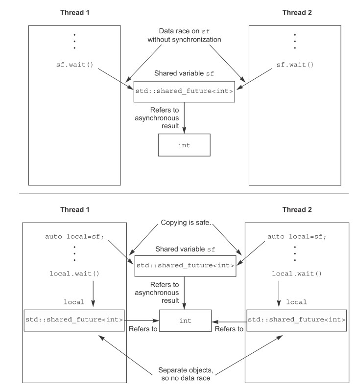

熟悉用 c++ 来编写可以跨平台的数据同步操作。

<!--more-->

# 等待事件或条件

## 使用条件变量

之前在看 [ostep](https://pages.cs.wisc.edu/~remzi/OSTEP/) 的时候熟悉过条件变量，但只是 Linux 平台下的。现在看看 c++ 标准库是如何使用的。

c++ 标准库在` <condition_variable>`头文件中提供了` std::condition_variable`和`std::condition_variable_any`两种条件变量。

其中` std::condition_variable`只能与`std::mutex`结合使用，而`std::condition_variable_any`可以与任何具有互斥作用的对象结合使用。但是后者的效率比不上前者，所以大部分时候还是使用的` std::condition_variable`。

最基本的使用如下：

```cpp
std::mutex mut;
std::condition_variable data_cond;
//用于存放数据的队列
std::queue<data_chunk> data_queue;      

//生产者
void data_preparation_thread() {
    while (more_data_to_prepare()) {
        const data_chunk data = prepare_data();
        {
			//将数据写入队列
            std::lock_guard<std::mutex> lk(mut);
            data_queue.push(data);
            //在退出这个局部区以后，互斥量就释放掉了              
        }
        //唤醒一个消费者
        //在互斥量释放之后再来唤醒消费者
        //如果在互斥量释放前唤醒消费者，那么此时很可能互斥量还没有释放完毕，那么消费者又需要进入一次等待，执行效率没有那么高
        data_cond.notify_one();
    }
}
// 消费者
void data_processing_thread() {
    while (true) {
        std::unique_lock<std::mutex> lk(mut);
        //等待数据，当 lambda 中的返回为真时，则会继续处理后面的数据，否则会释放互斥量然后继续睡眠    
        data_cond.wait(
            lk,[]{return !data_queue.empty();});
        //拷贝一个数据的副本，这样可以让临界区的执行时间尽量的短     
        data_chunk data = data_queue.front();
        data_queue.pop();
        //操作完数据需要释放互斥量
        lk.unlock();
        //到这里才是处理刚刚收到的数据          
        process(data);
        if (is_last_chunk(data))
            break;
    }
}
```

在消费者线程中，使用的是`std::unique_lock`。这是因为当条件变量不满足的时候，需要主动释放互斥量然后进入睡眠。而`std::lock_guard`并没有提供这些灵活操作的接口（并且在获取数据的副本后，也会主动释放互斥量以提高系统的并发度）。`wait`方法的执行逻辑就如同下面这段代码一样：

```cpp
template<typename Predicate>
void minimal_wait(std::unique_lock<std::mutex>& lk,Predicate pred) {
    while (!pred()) {
        lk.unlock();
        
        // 等待唤醒
        
        lk.lock();
    }
}
```

## 创建一个多线程安全的队列

我们可以基于前面的代码，将`std::queue`封装为一个多线程安全的队列：

```cpp
#include <queue>
#include <memory>
#include <mutex>
#include <condition_variable>
template<typename T>
class threadsafe_queue {
private:
	//在多线程环境下，互斥量会在 const 成员函数中被使用，需要加上 mutable 修饰
    mutable std::mutex mut;    
    std::queue<T> data_queue;
    std::condition_variable data_cond;
public:
    threadsafe_queue() {
        
    }
    threadsafe_queue(threadsafe_queue const& other) {
		//使用拷贝构造函数也需要做到互斥
        std::lock_guard<std::mutex> lk(other.mut);
        data_queue = other.data_queue;
    }
    void push(T new_value) {
        std::lock_guard<std::mutex> lk(mut);
        data_queue.push(new_value);
        data_cond.notify_one();
    }
    void wait_and_pop(T& value) {
        std::unique_lock<std::mutex> lk(mut);
        data_cond.wait(lk,[this]{return !data_queue.empty();});
        value = data_queue.front();
        data_queue.pop();
    }
    std::shared_ptr<T> wait_and_pop() {
        std::unique_lock<std::mutex> lk(mut);
        data_cond.wait(lk,[this]{return !data_queue.empty();});
        std::shared_ptr<T> res(std::make_shared<T>(data_queue.front()));
        data_queue.pop();
        return res;
    }
    bool try_pop(T& value) {
		//既然是试探性的获取数据，就不需要用到条件变量了
        std::lock_guard<std::mutex> lk(mut);
        if (data_queue.empty())
            return false;
        value = data_queue.front();
        data_queue.pop();
        return true;
    }
    std::shared_ptr<T> try_pop() {
        std::lock_guard<std::mutex> lk(mut);
        if(data_queue.empty())
            return std::shared_ptr<T>();
        std::shared_ptr<T> res(std::make_shared<T>(data_queue.front()));
        data_queue.pop();
        return res;
    }
    bool empty() const {
        std::lock_guard<std::mutex> lk(mut);
        return data_queue.empty();
    }
};
```

在使用的时候就更加简洁了：

```cpp
threadsafe_queue<data_chunk> data_queue;    
void data_preparation_thread() {
    while(more_data_to_prepare()) {
        const data_chunk data = prepare_data();
        data_queue.push(data);        
    }
}
void data_processing_thread() {
    while(true) {
        data_chunk data;
        data_queue.wait_and_pop(data);    
        process(data);
        if (is_last_chunk(data))
            break;
    }
}
```

如果想要同时唤醒多个线程，那就应该使用`notify_all()`方法。

信号量是 [c++ 20](https://en.cppreference.com/w/cpp/thread/counting_semaphore) 才提供的，如果在之前的版本要使用信号量，那就使用条件变量和互斥锁来实现信号量。被互斥的变量其实就是计数值：
- 释放信号量时计数值加 1
- 获取信号量时计数值减一

# 使用`future`等待一次性事件

future 用于标识等待一个一次性事件的发生，一旦该事件发生了，其`ready`标记为真且无法被清除。

在` <future>`头文件中提供了`std::future<>`和`std::shared_future<>`分别对应于独立和共享，就如同`std::unique_ptr`和`std::shared_ptr`一样。一个事件，只能有一个`std::future<>`与之关联。而多个`std::shared_future<>`可以关联同一个事件。

多个线程如果要并发的访问`std::future<>`则需要使用互斥量这些来保证互斥，而`std::shared_future<>`则没有这个限制。

## 获取线程的返回参数

假设需要一个线程来进行一个比较耗时的计算，如果使用`std::thread`来关联一个函数，那么获取其计算的结果还比较麻烦。这种情况下使用`std::async`与执行函数相关联，它会返回一个`std::future`以让使用者比较优雅的就可以获取到执行的返回值。

一个简单而优雅的示例如下：

```cpp
#include <iostream>
#include <future>

static int find_the_answer_to_ltuae() {
	return 1 + 1;
}

int main() {
	std::future<int> the_answer = std::async(find_the_answer_to_ltuae);

	//如果在使用 get() 时线程还没有运行完成，那么在此处则会阻塞等待线程运行完毕
	std::cout << "The answer is " << the_answer.get() << std::endl;

	return 0;
}
```

`std::async`的也可以给执行函数传递参数，和`std::thread`的使用方式是一样的：

```cpp
#include <string>
#include <future>
struct X {
    void foo(int,std::string const&);
    std::string bar(std::string const&);
};
X x;
//这里拷贝的是对象 x 的地址，所以其调用方式是： (&x)->foo(42, "hello")
auto f1 = std::async(&X::foo,&x,42,"hello");
//这里拷贝的是对象 x，所以其调用方式是：x.bar("goodbye")      
auto f2 = std::async(&X::bar,x,"goodbye");    
struct Y {
    double operator()(double);
};
Y y;
//这里通过类 Y 创建了一个临时对象，然后在内部以右值引用的方式传递给其 operator()
auto f3 = std::async(Y(),3.141);
//这里拷贝的是引用，所以其调用方式是y(2.718)       
auto f4 = std::async(std::ref(y),2.718);     
X baz(X&);
//由于 baz 这个函数需求的是左值引用，所以传递参数必须要使用 std::ref 
std::async(baz,std::ref(x));     
class move_only {
public:
    move_only();
    move_only(move_only&&)
    move_only(move_only const&) = delete;
    move_only& operator=(move_only&&);
    move_only& operator=(move_only const&) = delete;
    void operator()();
};
//创建临时对象，内部以右值引用的方式移动给 operator()
auto f5 = std::async(move_only());
```

可以对`std::async`配置策略，以显示的指定其执行策略是同步还是异步：

```cpp
//以异步的方式执行，也就是会在另外一个线程中执行
auto f6 = std::async(std::launch::async,Y(),1.2);
//推迟执行，在使用 wait() 或 get() 时才执行，相当于同步执行     
auto f7 = std::async(std::launch::deferred,baz,std::ref(x));
//下面这两种方式会根据代码的具体实现方式来选择是同步还是异步执行    
auto f8 = std::async(                           
   std::launch::deferred | std::launch::async,
   baz,std::ref(x));                          
auto f9 = std::async(baz,std::ref(x));

//比如 f7 使用 wait() 的时候， baz(x) 才执行          
f7.wait();
```

## 将 future 与一个任务关联

`std::packaged_task`提供了更为灵活的方式，它可以将一个可执行函数、可执行对象等与一个`std::future`绑定在一起，形成一个可执行对象。

然后这个可执行对象可以被同步或异步的被执行。执行的时候其返回值便会自动存储，而后可以通过关联的`std::future`来获取。

比如  `std::packaged_task<std::string(std::vector<char>*,int)>`打包后实例化的类就如同下面这样：
```cpp
template<>
class packaged_task<std::string(std::vector<char>*,int)> {
public:
    template<typename Callable>
    explicit packaged_task(Callable&& f);
    // std::future 类型和模板里面传入的返回值一致
    std::future<std::string> get_future();
    // 函数参数和模板里面传入的参数一致
    void operator()(std::vector<char>*,int);
};
```

对于处理批量任务，使用这个打包的方式，可以将这种多个对象都放入容器中便于管理:

```cpp
#include <iostream>
#include <cmath>
#include <thread>
#include <future>
#include <functional>
 
// unique function to avoid disambiguating the std::pow overload set
int f(int x, int y) { 
    return std::pow(x,y); 
}
 
void task_lambda() {
    std::packaged_task<int(int,int)> task([](int a, int b) {
        return std::pow(a, b); 
    });
    std::future<int> result = task.get_future();
 
    // 这个是同步执行，调用该函数的时候才执行，返回值会保存在 future 中
    task(2, 9);
 
    std::cout << "task_lambda:\t" << result.get() << '\n';
}
 
void task_bind() {
    std::packaged_task<int()> task(std::bind(f, 2, 11));
    std::future<int> result = task.get_future();
 
    // 这个是同步执行，调用该函数的时候才执行，返回值会保存在 future 中
    task();
 
    std::cout << "task_bind:\t" << result.get() << '\n';
}
 
void task_thread() {
    std::packaged_task<int(int,int)> task(f);
    std::future<int> result = task.get_future();
 
    // 这个是异步执行，调用该函数的时候才执行，返回值会保存在 future 中
    std::thread task_td(std::move(task), 2, 10);
    task_td.join();
 
    std::cout << "task_thread:\t" << result.get() << '\n';
}
 
int main() {
    task_lambda();
    task_bind();
    task_thread();
}
```

比如，GUI 有个独立的线程执行刷新任务，其它的任务要刷新线程必须要给这个 GUI 任务发送消息，这些线程或许还需要得到 GUI 线程执行该消息后的返回值。那么使用`std::package_task`就是合理的：

```cpp
#include <deque>
#include <mutex>
#include <future>
#include <thread>
#include <utility>
std::mutex m;
//存放消息的队列，每个元素都是一个 std::packaged_task
std::deque<std::packaged_task<void()> > tasks;
bool gui_shutdown_message_received();
void get_and_process_gui_message();
void gui_thread() {
	//事件循环，获取消息
    while (!gui_shutdown_message_received()) {
        get_and_process_gui_message();    
        std::packaged_task<void()> task;
        {
            std::lock_guard<std::mutex> lk(m);
            if (tasks.empty())                 
                continue;
            //从消息队列中取出一个消息
            task = std::move(tasks.front());   
            tasks.pop_front();
        }
        //执行该消息，同时与之关联的 std::future 也 reday 了
        task();    
    }
}
std::thread gui_bg_thread(gui_thread);
template<typename Func>
std::future<void> post_task_for_gui_thread(Func f) {
	//将一个消息任务与 future 绑定
    std::packaged_task<void()> task(f);       
    std::future<void> res = task.get_future();
    //消息存入消息队列     
    std::lock_guard<std::mutex> lk(m);
    tasks.push_back(std::move(task));
    // 返回与该消息绑定的 future，用户可以在需要的时候获取这个消息的执行返回结果
    // 如果对结果不感兴趣，也可以丢弃这个返回
    return res;                      
}
```

## 使用 std::promises

`std::promises`和`std::packaged_task`很类似，也是可以通过其` get_future()`方法获取一个`std::future`，然后它就可以组合使用。

`std::packaged_task`是用于执行一个函数，其返回值与`std::future`绑定。而`std::promises`是当其使用`set_value()`方法后，与其绑定的`std::future`便会是 ready 状态，如果`std::future`在其 ready 之前使用了 `get()`方法，那么将会阻塞的等待。

所以既可以使用`std::promises`实现线程间同步，也可以实现线程间的同步通信。

```cpp
#include <vector>
#include <thread>
#include <future>
#include <numeric>
#include <iostream>
#include <chrono>
 
void accumulate(std::vector<int>::iterator first,
                std::vector<int>::iterator last,
                std::promise<int> accumulate_promise) {
    int sum = std::accumulate(first, last, 0);
    // 执行这一步操作后，与 promise 绑定的 future 状态就会是 reday 状态
    accumulate_promise.set_value(sum);  // Notify future
}
 
void do_work(std::promise<void> barrier) {
    std::this_thread::sleep_for(std::chrono::seconds(3));
    // 等待 3 秒后，等待它的 future 就会被唤醒
    barrier.set_value();
}
 
int main() {
    // Demonstrate using promise<int> to transmit a result between threads.
    std::vector<int> numbers = { 1, 2, 3, 4, 5, 6 };
    std::promise<int> accumulate_promise;
    std::future<int> accumulate_future = accumulate_promise.get_future();
    std::thread work_thread(accumulate, numbers.begin(), numbers.end(),
                            std::move(accumulate_promise));
 
    // future::get() will wait until the future has a valid result and retrieves it.
    // Calling wait() before get() is not needed
    //accumulate_future.wait();  // wait for result
    std::cout << "result=" << accumulate_future.get() << '\n';
    work_thread.join();  // wait for thread completion
 
    // Demonstrate using promise<void> to signal state between threads.
    std::promise<void> barrier;
    std::future<void> barrier_future = barrier.get_future();
    std::thread new_work_thread(do_work, std::move(barrier));
    std::cout << "wait result\n";
    barrier_future.wait();
    std::cout << "wait result done\n";
    new_work_thread.join();
    
    return 0;
}
```

## 将异常存入 future

正常情况下，当一个函数抛出异常时，会层层向上传递，如果没有用户代码 catch 它，那么将会由标准库处理并退出用户进程。但是当使用了`std::future`，`std::promises`，`std::packaged_task`时，如果其关联函数抛出了异常，这个异常的值会被存储在 future 中。

使用`std::promises`来存储异常，然后在获取线程中获取异常才是一个优雅的做法：

```cpp
#include <iostream>
#include <stdexcept>
#include <future>
#include <thread>
#include <chrono>

static std::promise<int> result;

void func_div(int a, int b) {
    std::cout << "a = " << a << " b " << b << "\n";
    if(b == 0){
        result.set_exception(
                    std::make_exception_ptr(std::out_of_range("input out of range!\n"))
                    );
    } else {
        result.set_value(a / b);
    }
}

int main(void) {

    std::thread t(func_div, 10, 0);

    std::cout << "sleep 3 seconds\n";
    std::this_thread::sleep_for(std::chrono::seconds(3));
    std::cout << "get result\n";
    //在获取结果的时候，才抛出异常
    int ret = result.get_future().get();
    std::cout << "get result: " << ret << "\n";

    t.join();

    return 0;
}
```

## 多个线程等待同一个事件

当有多个线程在使用同一个`std::future`时，便会造成竞态。这种情况下应该使用`std::shared_future`。

这并不是说多个线程使用同一个`std::shared_future`，而是说每个线程都有一份对`std::shared_future`的拷贝，它们都访问自己的`std::shared_future`：




`std::shared_future`是通过`std::future`来获取，又由于`std::future`是不能被拷贝的，只能被移动，所以需要使用`std::move`：

```cpp
std::promise<int> p;
std::future<int> f(p.get_future());                      
std::shared_future<int> sf(std::move(f));
```

当然，对于创建的临时对象，也可以更加简单粗暴：

```cpp
std::promise<std::string> p;
std::shared_future<std::string> sf(p.get_future());
```

除此之外，`std::future`也具有一个`share()`方法来创建`std::shared_future`：

```cpp
std::promise< std::map< SomeIndexType, SomeDataType, SomeComparator,
    SomeAllocator>::iterator> p;
//sf 推导为  std::shared_future< std::map< SomeIndexType, SomeDataType, SomeComparator, //SomeAllocator>::iterator>
auto sf = p.get_future().share();
```

# 超时等待

对于时间的设定，可以设置相对时间（比如等待 100 毫秒）和绝对时间（比如等待至 2023年……）。

c++ 标准库提供了这两种时间的设定，对于相对时间，其操作方法以`_for`作为后缀，对于绝对时间，其操作方法以`_until`作为后缀。

> 比如对于 condition_variable 的 wait() 方法就有 wait_for() 和 wait_until() 两种超时等待。

## c++ 的时钟

c++ 标准库提供了头文件` <chrono>`以支持时钟相关的操作：

- `std::chrono::steady_clock`提供了具有固定不可被修改的时钟
- `std::chrono::system_clock`提供了通用时钟操作，可以被设定修改
- `std::chrono::high_resolution_clock`提供了高精度时钟操作

以上 3 个时钟都具有静态函数`now()`以获取一个绝对的时间点`time_point`。

## 时间段

### ratio

`ratio`头文件提供了模板类`std::ratio<num, den>`，其值代表分数，`num`就是分子（Numerator）的简写，`den`就是分母（denominator）的简写。

而在时间的角度来看的话，可以理解为`num`秒内有`den`次发生，也就是频率的表示。

> 比如 1毫秒，就是 1 秒内有 1000 次，那么就表示为：`std::ratio<1,1000>`。

该头文件还提供了很多实现定义的类型，便于用户直接使用：（详见[cppreference](https://en.cppreference.com/w/cpp/numeric/ratio/ratio)）

| 定义  |          等同于           |
| :---: | :-----------------------: |
| nano  | std::ratio<1, 1000000000> |
| micro |  std::ratio<1, 1000000>   |
|  ……   |            ……             |

```cpp
#include <iostream>
#include <ratio>

int main(void) {
    std::cout << std::ratio<1, 1000>::num << "\n";
    std::cout << std::ratio<1, 1000>::den << "\n";
    std::cout << std::micro::num << "\n";
    std::cout << std::micro::den << "\n";
	
	return 0;
}
```

输出为：

> 1
> 1000
> 1
> 1000000

### duration

头文件`<chrono>`提供了`std::chrono::duration<Rep,Period>`模板。

它与`std::ratio`联合使用，以表示在时间段内有多少个计数值。

第一个参数指定存储时间段的类型值，第二个参数指定`std::ratio`。

比如：

- 使用`short`存储一分钟的计数值：`std::chrono::duration<short,std::ratio<60,1>>`
- 使用`double`存储毫秒： `std::chrono::duration<double,std::ratio<1,1000>>`

为了方便，标准库还提供了`std::nanoseconds,  std::microseconds,  std::milliseconds,  std::seconds, std::minutes, std::hours`等这些定义好的时间段值。

```cpp
#include <iostream>
#include <ratio>
#include <chrono>

int main(void) {
    //得到一个代表两秒的值
    auto t = std::chrono::seconds(2);

    //当前频率是 1 秒钟有 50 次跳动
    std::chrono::duration<int, std::ratio<1, 50>> val(t);

    //那么两秒对应的就是 100 次跳动
    std::cout << "count of val " << val.count() << "\n";

	
	return 0;
}
```

在 c++14 及以后，还提供了`std::chrono_literals`以使用字面值来表示时间段：

```cpp
using namespace std::chrono_literals;
auto one_day = 24h;
auto half_an_hour= 30min;
auto max_time_between_messages= 30ms;
```

 这样`15ns` 就等同于 `std::chrono::nanoseconds(15)`:

```cpp
#include <iostream>
#include <ratio>
#include <chrono>

int main(void) {
    using namespace std::chrono_literals;
    //得到一个代表两秒的值
    auto t = 2s;

    //当前频率是 60 秒钟有 1 次跳动，也就是一分钟
    std::chrono::duration<double, std::ratio<60, 1>> val(t);

    //那么两秒对应的就是 0.0333 次跳动，也就是 0.0333 分钟
    std::cout << "count of val " << val.count() << "\n";

	
	return 0;
}
```

`std::chrono::duration_cast<>`用于时间之间的转换，这里可能会有精度的损失（比如毫秒转换到秒）：

```cpp
#include <iostream>
#include <ratio>
#include <chrono>

int main(void) {
    std::chrono::milliseconds ms(54802);
    //最终转换为 54 秒
    std::chrono::seconds s = std::chrono::duration_cast<std::chrono::seconds>(ms);

    std::cout << "conver " << ms.count() << " ms to " << s.count() << " s\n";

	
	return 0;
}
```

周期之间也可以进行简单的运算，比如 5 秒可以使用：`5*seconds(1)`或`minutes(1) – seconds(55)`，它们都等同于` seconds(5)`。

## 时间点

`std::chrono::time_point<>`用于表示一个绝对的时间点，它有两个参数。第一个参数用于表示这个时间点的参考时钟，第二个参数用于表示时间段：

```cpp
#include <iostream>
#include <ctime>
#include <chrono>
#include <ratio>
#include <iomanip>

int main() {
    using namespace std::literals; // enables the usage of 24h, 1ms, 1s instead of
                                   // e.g. std::chrono::hours(24), accordingly

    //以系统时钟作为参考，周期是 100 纳秒
    const std::chrono::time_point<std::chrono::system_clock,
            std::chrono::duration<long long, std::ratio<1, 10000000>>> now =
        std::chrono::system_clock::now();

    std::cout << "time since epoch with seconds " <<
                std::chrono::duration_cast<std::chrono::seconds>(now.time_since_epoch()).count()
              << "\n";

    const std::time_t t_c = std::chrono::system_clock::to_time_t(now - 24h);
    std::cout << "24 hours ago, the time was "
              << std::put_time(std::localtime(&t_c), "%F %T.\n") << std::flush;

    return 0;
}
```

对于使用相同参考时钟的时间点，也可以进行加减运算。比如下面经过时间点求差得出一段代码的运行时间：

```cpp
#include <iostream>
#include <ctime>
#include <chrono>
#include <ratio>
#include <iomanip>

int main() {
    auto start = std::chrono::high_resolution_clock::now();
    for(int i = 0; i < 0xffffff; ++i){

    }
    auto stop = std::chrono::high_resolution_clock::now();
    std::cout<<"for loop took "
             << std::chrono::duration_cast<std::chrono::microseconds> (stop-start).count()
             << " microseconds" << std::endl;

    return 0;
}
```

## 超时等待相关的函数

以延迟为例可以通过`std::this_thread::sleep_for`使用相对的延迟，和通过`std::this_thread::sleep_until`使用绝对延迟：

```cpp
#include <iostream>
#include <chrono>
#include <ratio>
#include <thread>

int main() {
    auto start = std::chrono::high_resolution_clock::now();
    //使用相对延迟，延迟两秒
    std::this_thread::sleep_for(std::chrono::seconds(2));

    auto stop = std::chrono::high_resolution_clock::now();
    std::cout<<"relative delay took "
             << std::chrono::duration_cast<std::chrono::microseconds> (stop-start).count()
             << " microseconds" <<std::endl;

    start = std::chrono::high_resolution_clock::now();
    //使用绝对延迟，延迟 800 毫秒
    std::this_thread::sleep_until(std::chrono::system_clock::now() + std::chrono::milliseconds(800));

    stop = std::chrono::high_resolution_clock::now();
    std::cout<<"absolute delay took "
             << std::chrono::duration_cast<std::chrono::microseconds> (stop-start).count()
             << " microseconds" <<std::endl;

    return 0;
}
```

除了延迟以外，其它的便是超时等待相关的函数。同样的，使用`xxx_for`便是相对时间，而使用`xxx_until`则是绝对时间。常用的功能函数总结如下：

- `std::this_thread::sleep_for` / `std::this_thread::sleep_until`
- `std::condition_variable::wait_for` / `std::condition_variable::wait_until`
- `std::condition_variable_any::wait_for` / `std::condition_variable_any::wait_until`
- `std::timed_mutex::try_lock_for` / `std::timed_mutex::try_lock_until`
- `std::recursive_timed_mutex::try_lock_for` / `std::recursive_timed_mutex::try_lock_until`
- `std::shared_timed_mutex::try_lock_for` / `std::shared_timed_mutex::try_lock_until`
- `std::shared_timed_mutex::try_lock_shared_for` / `std::shared_timed_mutex::try_lock_shared_until`
- `std::unique_lock<Mutex>::try_lock_for` / `std::unique_lock<Mutex>::try_lock_until`
- `std::shared_lock<Mutex>::try_lock_for` / `std::shared_lock<Mutex>::try_lock_for`
- `std::future<T>::wait_for` / `std::future<T>::wait_until`
- `std::shared_future<T>::wait_for` / `std::shared_future<T>::wait_until`

# 线程间同步的应用

比起简单的将数据暴露出来给多个线程共享，使用函数式编程是可以简化代码的一个好方法。

## 函数式编程与`std::future`

下面以快速排序为例，来展示函数式编程是如何做到多线程安全的。

### c 代码实现快速排序

快速排序思路如下：

1. 选择数据的一个点作为 pivot 与其他数做比较
2. 小于 pivot 的数放一边，大于或等于 pivot 的数放另外一半
3. 递归的进行步骤 2，递归的终止条件便是当前需要判断的数组值只有 1 个时，排序便完成了

下面是一个简易的 c 代码示例：

```c
#include <stdio.h>
#include <stdint.h>

static void swap(int *a, int *b) {
    int tmp = *a;
    *a = *b;
    *b = tmp;
}

static int partition(int *buf, int p, int r) {
    int i = p;

    // 这里选取 r 作为 pivot
    for (int j = p; j <= r - 1; j++) {
        if (buf[j] < buf[r]) {
            if (i != j) {
                swap(&buf[j], &buf[i]);
            }
            i++;
        }
    }

    swap(&buf[i], &buf[r]);

    return i;
}

static void quick_sort_frame(int *buf, int p, int r) {
    if (p >= r) {
            return ;
    }
    int q = partition(buf, p, r);

    printf("quick_sort p = %d, r = %d, q = %d\n", p, r, q);
    for (int i = p; i <= r; i++) {
        printf("%d,", buf[i]);
    }
    printf("\n");
    quick_sort_frame(buf, p, q - 1);
    quick_sort_frame(buf, q + 1, r);
}
static void quick_sort(int *buf, int size) {
    quick_sort_frame(buf, 0, size - 1);
}

#define BUF_SIZE 10
static int buf[BUF_SIZE];
int main(int argc, char *argv[]) {

    printf("before sort, buffer contents are:\n");

    for (int8_t i = 0; i < BUF_SIZE; i++) {
            buf[i] = BUF_SIZE - i;
            printf("%d,", buf[i]);
    }
    printf("\n");

    quick_sort(buf, BUF_SIZE);

    printf("after sort, buffer contents are:\n");
    for (int8_t i = 0; i < BUF_SIZE; i++) {
            printf("%d,", buf[i]);
    }
    printf("\n");
    return 0;
}
```

其输出为：

```shell
before sort, buffer contents are:
10,9,8,7,6,5,4,3,2,1,
quick_sort p = 0, r = 9, q = 0
1,9,8,7,6,5,4,3,2,10,
quick_sort p = 1, r = 9, q = 9
9,8,7,6,5,4,3,2,10,
quick_sort p = 1, r = 8, q = 1
2,8,7,6,5,4,3,9,
quick_sort p = 2, r = 8, q = 8
8,7,6,5,4,3,9,
quick_sort p = 2, r = 7, q = 2
3,7,6,5,4,8,
quick_sort p = 3, r = 7, q = 7
7,6,5,4,8,
quick_sort p = 3, r = 6, q = 3
4,6,5,7,
quick_sort p = 4, r = 6, q = 6
6,5,7,
quick_sort p = 4, r = 5, q = 4
5,6,
after sort, buffer contents are:
1,2,3,4,5,6,7,8,9,10,
```

### c++ 代码实现快速排序

```cpp
#include <iostream>
#include <list>
#include <algorithm>

template<typename T>
std::list<T> sequential_quick_sort(std::list<T> input) {
    if (input.empty()) {
        return input;
    }
    std::list<T> result;
    // 取 list 头的元素作为 pivot
    result.splice(result.begin(), input, input.begin());
    T const& pivot = *result.begin();

    // 将 list 中剩余的元素和 pivot 做比较
    auto divide_point = std::partition(input.begin(), input.end(),
            [&](T const& t){return t < pivot;});
    // 将分类好的小于 pivot 的元素放入 lower_part
    // 那么 input 中的剩余元素便是大于或等于 pivot 的元素
    std::list<T> lower_part;
    lower_part.splice(lower_part.end(), input, input.begin(),
        divide_point);
    // 将两个区间的元素递归
    auto new_lower(
        sequential_quick_sort(std::move(lower_part)));
    auto new_higher(
        sequential_quick_sort(std::move(input)));
    // 大于或等于 pivot 的元素依次放在 pivot 的右边
    result.splice(result.end(), new_higher);
    // 小于 pivot 的元素依次放在 pivot 的左边
    result.splice(result.begin(), new_lower);

    return result;
}

int main() {
    std::list<int> vals = {10, 9, 8, 7, 6, 5, 4, 3, 2, 1};

    std::cout << "contents of vals before sort:\n";
    for (auto v : vals) {
        std::cout << v << ",";
    }
    std::cout << "\n";

    vals = sequential_quick_sort(vals);

    std::cout << "contents of vals after sort:\n";
    for (auto v : vals) {
        std::cout << v << ",";
    }
    std::cout << "\n";

    return 0;
}
```

可以看到，与上面 c 版本的实现思路是完全一样的，只是有标准库的加持，使得代码看起来更为简洁。

### 并行实现快速排序

以上的 c++ 代码是由一个线程来完成了，如果可以由多个线程来完成并行排序便可以更加快速的得出结果。

这里就需要考虑到 data race 的问题了，使用`std::future`是一个比较优雅的解决方案。

由于每次分为两个部分后，又需要对这两个部分递归，所以将其中一个部分分离为一个单独的线程是可以提供并发度的：

```cpp
#include <iostream>
#include <list>
#include <algorithm>
#include <future>

template<typename T>
std::list<T> sequential_quick_sort(std::list<T> input) {
    if (input.empty()) {
        return input;
    }
    std::list<T> result;
    // 取 list 头的元素作为 pivot
    result.splice(result.begin(), input, input.begin());
    T const& pivot = *result.begin();

    // 将 list 中剩余的元素和 pivot 做比较
    auto divide_point = std::partition(input.begin(), input.end(),
            [&](T const& t){return t < pivot;});
    // 将分类好的小于 pivot 的元素放入 lower_part
    // 那么 input 中的剩余元素便是大于或等于 pivot 的元素
    std::list<T> lower_part;
    lower_part.splice(lower_part.end(), input, input.begin(),
        divide_point);
    // 将小于区间的元素放在另一个线程访问
    std::future<std::list<T>> new_lower(
        	// 最后会使用 new_lower.get() 来获取结果，所以这里可以使用移动语义
            // 因为栈上的变量可以确保有效性
            std::async(&sequential_quick_sort<T>, std::move(lower_part))
            );

    auto new_higher(
        sequential_quick_sort(std::move(input)));
    // 大于或等于 pivot 的元素依次放在 pivot 的右边
    result.splice(result.end(),new_higher);
    // 小于 pivot 的元素依次放在 pivot 的左边
    result.splice(result.begin(),new_lower.get());

    return result;
}

int main() {
    std::list<int> vals = {10, 9, 8, 7, 6, 5, 4, 3, 2, 1};

    std::cout << "contents of vals before sort:\n";
    for (auto v : vals) {
        std::cout << v << ",";
    }
    std::cout << "\n";

    vals = sequential_quick_sort(vals);

    std::cout << "contents of vals after sort:\n";
    for (auto v : vals) {
        std::cout << v << ",";
    }
    std::cout << "\n";

    return 0;
}
```

由于两个线程分别是处理两边的数据，也不会有 data race 的情况出现。

这里需要注意的是线程的并发数量，是递归的 2^n 次方。

> 比如递归 10 次，线程的数量就是 1024 个。

所以，要根据当前硬件所支持的并发数来决定是使用`std::launch::deferrred`还是`std::launch::async`。

> 默认情况下不填这项，那就依赖编译器的实现来完成不同的策略。

如果要使用纯 c 来实现这个并行方式，则需要更多的代码且不易维护。

## 通过消息传递来完成同步

CSP（Communicating Sequential Process）编程方式就是指：以消息传递的方式在各个线程间共享数据。

每个线程当前的状态根据接收到的消息而定，在处理消息时各个线程都是完全独立的而不会有 data race 的情况出现。

这种方式使得并发编程变得简单而易于维护。

> 这个过程中的临界资源便是消息队列，可以使用类将其封装起来而易于使用。

一个比较简单的示例如下：

```cpp
struct card_inserted {
    std::string account;
};
class atm {
    messaging::receiver incoming;
    messaging::sender bank;
    messaging::sender interface_hardware;
    // 这个函数指针指向当前正在执行的状态
    void (atm::*state)();
    std::string account;
    std::string pin;
    void waiting_for_card() {
        interface_hardware.send(display_enter_card());   
        incoming.wait()                             
            .handle<card_inserted>(
                [&](card_inserted const& msg) {
                    account = msg.account;
                    pin = "";
                    interface_hardware.send(display_enter_pin());
                    // 当满足条件后，便切换状态
                    state = &atm::getting_pin;
                }
                );
    }
    void getting_pin();
public:
    void run() {
		// 默认的初始状态
        state = &atm::waiting_for_card;     
        try {
            for(;;) {
				// 执行当前状态
                (this->*state)();    
            }
        }
        catch(messaging::close_queue const&) {
        }
    }
};
```

可以看到：

1. 一个线程只执行当前的状态，状态的切换并不会引起临界区的问题
2. 多个线程都维护自己的状态，这使得并发逻辑变得非常简单
3. 唯一需要注意的便是消息队列的互斥问题