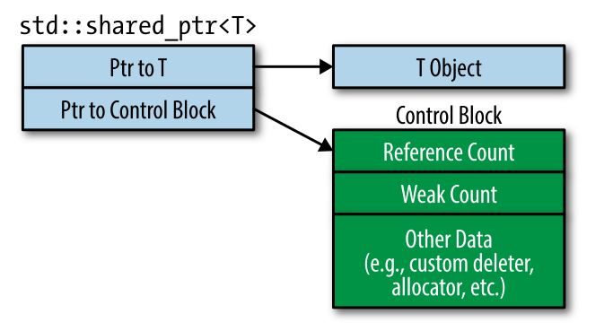

`shared_ptr`使用对资源的引用计数来决定是否释放资源：
- 构造函数会使得对资源的引用计数加 1
- 而析构函数和赋值构造函数都会将**对当前指向资源的引用计数减 1**
- 当对资源的引用计数为 0 时，就会释放该资源
<!--more-->

# `shared_ptr` 的特点

既然`shared_ptr`使用引用计数来保存对资源的引用数，那么：

- `shared_ptr`的大小是原始指针的两倍，因为包含资源指针和引用计数
- 引用计数也是动态申请的，这个后面会解释
- 引用计数的改变必须是原子的，以避免出现并发修改而导致的错误

综上可以看出：`shared_ptr`的运行效率低于`unique_ptr`。

> 但在使用移动语义对`shared_ptr`进行操作时，由于不需要修改引用计数，所以其操作效率也是比较高的。

# 自定义`delete`函数

## 定义

自定义`delete`函数时，`shared_ptr`在定义时和`unique_ptr`有些不同，应该说是`shared_ptr`更为优雅：

```cpp
auto loggingDel = [](Widget *pw)        // custom deleter
                  {                     
                    makeLogEntry(pw);
                    delete pw;
                  };
std::unique_ptr<                        // deleter type is
  Widget, decltype(loggingDel)          // part of ptr type
  > upw(new Widget, loggingDel);
std::shared_ptr<Widget>                 // deleter type is not
  spw(new Widget, loggingDel);          // part of ptr type
```

## 灵活性

`shared_ptr`即使使用了不同类型的`delete`函数，都可以放在同一个`vector`中：

```cpp
auto customDeleter1 = [](Widget *pw) { … };    // custom deleters,
auto customDeleter2 = [](Widget *pw) { … };    // each with a
                                               // different type
std::shared_ptr<Widget> pw1(new Widget, customDeleter1);
std::shared_ptr<Widget> pw2(new Widget, customDeleter2);
std::vector<std::shared_ptr<Widget>> vpw{ pw1, pw2 };
```

因为`pw1`和`pw2`是属于同一个类型的，所以它们也可以赋值、所为参数传递等。但`unique_ptr`就不行，因为它们的定义形式不同，类型也就不一样。

## 大小

`unique_ptr`在使用自定义`delete`函数后，其占用会增大。但是，`shared_ptr`的大小确不会改变。



如上图所示，这是因为`shared_ptr`中的成员变量一个是指向类型的指针，一个是指向 Control Block 的指针。

所以新增的内容都会位于 Control Block 的堆区，而不会影响`shared_ptr`的大小。

有以下几种情况会创建 Control Block ：

1. 使用`std::make_shared`总是会创建 control block
2. 当使用独占指针（`std::unique_ptr`或`std::auto_ptr`）来创建一个`shared_ptr`时，因为独占指针不包含 control block
3. 当使用原始指针来创建一个`shared_ptr`时

尤其是第三点需要特别注意，也就是说：

> 当将一个原始指针用于创建多个`shared_ptr`时，就会有多个 Control Block。
>
> 那就意味着有多个 Reference Count，那么就会导致同一个指针会被释放多次的问题。
>
> 所以最稳妥的方式是使用`make_shared`。

比如像下面这样，`pw`就会被释放两次：

```cpp
auto pw = new Widget;                          // pw is raw ptr
…
std::shared_ptr<Widget> spw1(pw, loggingDel);  // create control
                                               // block for *pw
…
std::shared_ptr<Widget> spw2(pw, loggingDel);  // create 2nd
                                               // control block
                                               // for *pw!
```

如果确实要使用原始指针，那么使用下面的方式才是正确的：

```cpp
std::shared_ptr<Widget> spw1(new Widget,    // direct use of new
                             loggingDel);
std::shared_ptr<Widget> spw2(spw1);     // spw2 uses same
                                        // control block as spw1
```

# `shared_ptr`不能用于数组

`shared_ptr`并没有像`unique_ptr`一样提供了`std::shared_ptr<T[]>`这样的功能函数，所以它不能作用于数组。


