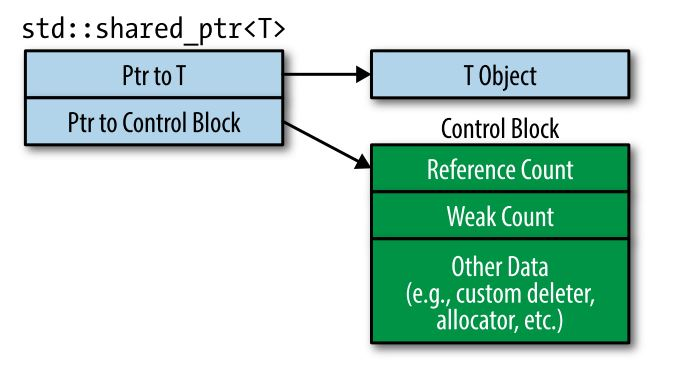

传统指针具有以下缺陷：

1. 单从一个指针的声明，无法判定它是指向一个对象还是指向一个包含该对象的数组
2. 单从一个指针的声明，无法判定当不使用该指针时，是否需要释放它所指向对象所占用的资源
3. 当需要释放指针所指向对象的资源时，并不能明确的知道是该使用`delete`，还是使用其它专有的释放函数
4. 当需要使用`delete`释放资源时，到底是使用`delete`还是`delete[]`，这需要小心使用，否则会造成内存泄漏或未定义行为
5. 当确定了释放机制时，也有可能写代码时一不小心，就造成了 double free
6. 当释放一个资源时，有可能还有其它指针（Dangling pointers）指向该资源，从而导致很多很难查的 BUG

使用智能指针变能够最大化的避免以上问题。

<!--more-->

# 当指针独占资源时，应该使用 unique_ptr

## `unique_ptr` 的特点

1. `unique_ptr` 和原始指针的大小一样大，并且执行效率也高，可以满足一些对内存和运行性能有要求的场合。
2. `unique_ptr`属于独占所指向的资源，因此不能将其赋值给另外的`unique_ptr`，而只能使用移动语义 

## `unique_ptr`的使用场合

### 在工厂函数中使用

一般工厂函数都会返回一个`unique_ptr`，使用者可以没有心理负担的正常使用。

当该`unique_ptr`退出代码块后，便会自动调用析构函数来释放其所指向的资源。而不用担心中途的异常发生而非正常的跳出该代码块。

当某些资源不能使用正常的`delete`释放时，用户可以定义自己的`delete function`：

```cpp
auto delInvmt = [](Investment* pInvestment) {     // custom deleter 
                  makeLogEntry(pInvestment);      // (a lambda expression)
                  delete pInvestment;             
};
template<typename... Ts>                          // revised
std::unique_ptr<Investment, decltype(delInvmt)>   // return type
makeInvestment(Ts&&... params) {
  std::unique_ptr<Investment, decltype(delInvmt)> // ptr to be returned
    pInv(nullptr, delInvmt);                       
  if ( /* a Stock object should be created */ ) {
    pInv.reset(new Stock(std::forward<Ts>(params)...));
  } else if ( /* a Bond object should be created */ ) {
    pInv.reset(new Bond(std::forward<Ts>(params)...));
  } else if ( /* a RealEstate object should be created */ ) {
    pInv.reset(new RealEstate(std::forward<Ts>(params)...));
  }
  return pInv;
}
```

在 c++14 中，则可以使用更加智能的推导方式：

```cpp
template<typename... Ts>
auto makeInvestment(Ts&&... params) {              // C++14
  auto delInvmt = [](Investment* pInvestment) {    // this is now inside make Investment
                    makeLogEntry(pInvestment);   
                    delete pInvestment;          
                  };
  std::unique_ptr<Investment, decltype(delInvmt)>   // as before
    pInv(nullptr, delInvmt);                         
  if ( … ) {                                         // as before
    pInv.reset(new Stock(std::forward<Ts>(params)...));
  } else if ( … ) {                                    // as before
    pInv.reset(new Bond(std::forward<Ts>(params)...));
  } else if ( … ) {                                    // as before
    pInv.reset(new RealEstate(std::forward<Ts>(params)...));
  }
  return pInv;                                      // as before
}
```

使用`lambda`来定义删除函数的好处是：使用该种方式不会使得`unique_ptr`的体积增加，而使用普通函数的定义方式则会使得`unique_ptr`的体积增加。

工厂函数之所以返回的是`unique_ptr`，是因为这种返回方式可以不用关心调用者使用的是`shared_ptr`还是`unique_ptr`，这样更能适用于更加广泛的场合。

> 返回的`unique_ptr`是临时对象，则编译器会尝试使用移动语义将该对象移动到被赋值变量中。

### 对数组使用

对数组使用的方式是`std::unique_ptr<T[]>`，一般使用这种方式都是在使用该指针指向 c 代码所提供的从堆中申请的内存地址。

在 c++ 中，使用`std::array`,`std::vector`总是优于使用原始的数组。

# 使用 shared_ptr 来管理共享的堆资源

`shared_ptr`使用对资源的引用计数来决定是否释放资源：

- 构造函数会使得对资源的引用计数加 1
- 而析构函数和赋值构造函数都会将**对当前指向资源的引用计数减 1**
  
  > 赋值构造引用计数减 1，指的是：当前`shared_ptr`已经指向了一个对象，当它被另一个`shared_ptr`赋值时，那指向原来对象的`shared_ptr`关联计数就会减一，指向新对象的`shared_ptr`关联计数就会加一。
- 当对资源的引用计数为 0 时，就会释放该资源

## `shared_ptr` 的特点

既然`shared_ptr`使用引用计数来保存对资源的引用数，那么：

- `shared_ptr`的大小是原始指针的两倍，因为包含资源指针和引用计数
- 引用计数也是动态申请的，这个后面会解释
- 引用计数的改变必须是原子的，以避免出现并发修改而导致的错误

综上可以看出：`shared_ptr`的运行效率低于`unique_ptr`。

> 但在使用移动语义对`shared_ptr`进行操作时，由于不需要修改引用计数，所以其操作效率也是比较高的。

## 自定义`delete`函数

### 定义

自定义`delete`函数时，`shared_ptr`在定义时和`unique_ptr`有些不同，应该说是`shared_ptr`更为优雅：

```cpp
auto loggingDel = [](Widget *pw) {       // custom deleter
                    makeLogEntry(pw);
                    delete pw;
                  };
std::unique_ptr<                        // deleter type is part of ptr type
  Widget, decltype(loggingDel)           
  > upw(new Widget, loggingDel);
std::shared_ptr<Widget>                 // deleter type is not part of ptr type
  spw(new Widget, loggingDel);           
```

### 灵活性

`shared_ptr`即使使用了不同类型的`delete`函数，都可以放在同一个`vector`中：

```cpp
auto customDeleter1 = [](Widget *pw) { … };    // custom deleters,each with a different type
auto customDeleter2 = [](Widget *pw) { … };     

std::shared_ptr<Widget> pw1(new Widget, customDeleter1);
std::shared_ptr<Widget> pw2(new Widget, customDeleter2);
std::vector<std::shared_ptr<Widget>> vpw{ pw1, pw2 };
```

因为`pw1`和`pw2`是属于同一个类型的，所以它们也可以赋值、所为参数传递等。但`unique_ptr`就不行，因为它们的定义形式不同，类型也就不一样。

### 大小

`unique_ptr`在使用自定义`delete`函数后，其占用会增大。但是，`shared_ptr`的大小确不会改变。



如上图所示，这是因为`shared_ptr`中的成员变量一个是指向类型的指针，一个是指向 Control Block 的指针。

所以新增的内容都会位于 Control Block 的堆区，而不会影响`shared_ptr`的大小。

有以下几种情况会创建 Control Block ：

1. 使用`std::make_shared`总是会创建 control block
2. 当使用独占指针（`std::unique_ptr`或`std::auto_ptr`）来创建一个`shared_ptr`时，因为独占指针不包含 control block
3. 当使用原始指针来创建一个`shared_ptr`时

尤其是第三点需要特别注意，也就是说：

> 当将一个原始指针用于创建多个`shared_ptr`时，就会有多个 Control Block。
> 
> 那就意味着有多个 Reference Count，那么就会导致同一个指针会被释放多次的问题。
> 
> 所以最稳妥的方式是使用`make_shared`。

比如像下面这样，`pw`就会被释放两次：

```cpp
auto pw = new Widget;                          // pw is raw ptr
…
std::shared_ptr<Widget> spw1(pw, loggingDel);  // create control  block for *pw
std::shared_ptr<Widget> spw2(pw, loggingDel);  // create 2nd control block for *pw!
```

如果确实要使用原始指针，那么使用下面的方式才是正确的：

```cpp
std::shared_ptr<Widget> spw1(new Widget,    // direct use of new
                             loggingDel);
std::shared_ptr<Widget> spw2(spw1);     // spw2 uses same control block as spw1
```

## `shared_ptr`不能用于数组

`shared_ptr`并没有像`unique_ptr`一样提供了`std::shared_ptr<T[]>`这样的功能函数，所以它不能作用于数组。

> 使用 `std::array`,`std::vector`,`std::string`这类类才是正确的方式

# 使用 weak_ptr 来检查 shared_ptr 资源是否已经释放

## 理解 `weak_ptr`

`std::weak_ptr`附属于`shared_ptr`，`weak_ptr`并不会影响资源引用计数的增加和减小，当最后一个`shared_ptr`被销毁时，资源便会被释放，就算现在依然存在`weak_ptr`。

`weak_ptr`并不能够被解引用，它的目的主要是为了探测`shared_ptr`之间所指向的资源是否已经释放。

其应用场景一般是在当需要新建一个`shared_ptr`时或需要操作该资源时，首先使用`weak_ptr`来查看该资源是否已经释放，以避免未定义的行为。

要理解其使用场景，首先查看下面的代码：

```cpp
#include <vector>
#include <iostream>
#include <array>
#include <memory>

int main(void) {
    auto spi = std::make_shared<int>(10);
    std::weak_ptr<int> wpi(spi);

    std::cout << "The value of spi is " << *spi << "\n";
    std::cout << "Is wpi expired: " << wpi.expired() << "\n";

    //资源已被释放
    spi = nullptr;

    std::cout << "Is wpi expired: " << wpi.expired() << "\n";

    return 0;
}
```

当`shared_ptr`所指向的资源被释放时，`weak_ptr`的`expired()`方法将返回`true`。

## 多线程下的 `weak_ptr`

但如果是在多线程的应用场景，就有可能出现临界区问题：

- 线程 T1 通过`expired()`返回`false`判定资源还没有被释放，于是决定新建一个`shared_ptr`
- 在线程 T1 执行完`expired()`后，线程 T2 抢占了 T1 运行，T2 中指向同一资源的最后一个`shared_ptr`被销毁，该资源被释放
- T1 重新运行，该`shared_ptr`指向一段未知的堆区域，接下来对该`shared_ptr`操作结果都是未知的

所以，加锁是必须的：

```cpp
#include <vector>
#include <iostream>
#include <array>
#include <memory>

int main(void) {
    auto spi = std::make_shared<int>(10);
    std::weak_ptr<int> wpi(spi);

    std::cout << "The value of spi is " << *spi << "\n";

    // 通过 lock() 方法返回 shared_ptr，如果资源已经被释放了，则返回 nullptr
    auto spi2 = wpi.lock();
    if(spi2 != nullptr) {
        std::cout << "The value of spi2 is " << *spi2 << "\n";
    }

    //资源已被释放
    spi = nullptr;
    spi2 = nullptr;

    auto spi3 = wpi.lock();
    if(spi3 != nullptr) {
        std::cout << "The value of spi3 is " << *spi3 << "\n";
    } else {
        std::cout << "The resource is not existent!\n";
    }

    return 0;
}
```

## 应用场景

一个应用场景便是在观察者模式中，发送者会含有许多观察者的基类指针。如果这些观察者都是在堆上申请，且有可能被其他代码所释放掉，那么使用`weak_ptr`是一个比较优雅的办法。

> 一旦 `lock()`方法返回为`nullptr`，则代表该观察者已经被销毁，则就不应该再向它发送消息了。

# make_shared 和 make_unique 优于使用 new

`std::make_shared` 是 c++11 的一部分，但是`std::make_unique`是在 c++14 才被加入标准的。如果要在 c++ 11 中使用，可以自己定义一个简易版本：

```cpp
template<typename T, typename... Ts>
std::unique_ptr<T> make_unique(Ts&&... params) {
  return std::unique_ptr<T>(new T(std::forward<Ts>(params)...));
}
```

> 这个版本无法指向原始数组，也无法定制删除函数

## 为什么要使用`make`函数

### 简洁性

```cpp
auto upw1(std::make_unique<Widget>());      // with make func
std::unique_ptr<Widget> upw2(new Widget);   // without make func
auto spw1(std::make_shared<Widget>());      // with make func
std::shared_ptr<Widget> spw2(new Widget);   // without make func
```

从上面这段代码可以看出，使用`make`函数，便可以使用`auto`来推导对象的类型。

而使用`new`来创建对象的话，就需要显示的写明对象的类型，这在以后修改类型时，就有点麻烦。

### 保证安全性

比如有如下函数定义：

```cpp
void processWidget(std::shared_ptr<Widget> spw, int priority);
```

并且使用`new`来传入对象：

```cpp
processWidget(std::shared_ptr<Widget>(new Widget),  // potential resource leak!
              computePriority());                    
```

这种情况下就有可能造成内存泄漏。

`shared_ptr`的创建一定要在`new`之后，以获取`new`的地址进行管理，那么正常的流程应该是：

1. `new`先创建一个 Widget 对象
2. 调用`shared_ptr`的构造函数，获取 Widget 对象的地址进行管理
3. 执行 computePriority() 函数

但如果编译器进行了优化，就有可能会执行下面这个顺序：

1. `new`先创建一个 Widget 对象
2. 执行 computePriority() 函数
3. 调用`shared_ptr`的构造函数，获取 Widget 对象的地址进行管理

假设在执行第二步时，computePriority() 抛出了一个异常，那么第三步就无法执行，第一步申请的内存无法释放就造成了内存泄漏。

使用`make`函数便可以避免此问题：

```cpp
processWidget(std::make_shared<Widget>(),   // no potential resource leak
              computePriority());           
```

因为使用`make`函数就将步骤变成了两步，这样无论谁先执行，都能保证不会造成内存泄漏。

### 效率

对于`shared_ptr`要管理一段资源，除了要申请该资源的内存还要申请对应的 control block。

如果使用`new`来创建对象资源，那么申请资源就要分为两步：

```cpp
std::shared_ptr<Widget> spw(new Widget);
```

如果使用`make`函数，那就将两个步骤合并为一个步骤，提高了效率：

```cpp
auto spw = std::make_shared<Widget>();
```

## `make`函数的缺陷

### `delete`函数

使用`make`函数时，并不能定义`delete`函数，这种情况下只能使用`new`来完成：

```cpp
auto widgetDeleter = [](Widget* pw) { … };
std::unique_ptr<Widget, decltype(widgetDeleter)>
  upw(new Widget, widgetDeleter);
std::shared_ptr<Widget> spw(new Widget, widgetDeleter);
```

所以，在之前的安全性讨论中，如果需要新建`delete`方法，那么就需要将对象的创建分为单独的一行来实现：

```cpp
std::shared_ptr<Widget> spw(new Widget, cusDel);
processWidget(spw, computePriority()); 
```

### 初始化的限制

使用`make`函数调用的是括号初始化：

```cpp
auto upv = std::make_unique<std::vector<int>>(10, 20);
auto spv = std::make_shared<std::vector<int>>(10, 20);
```

以上代码都是创建有 10 个元素，每个元素值为 20 的 vector。

如果想使用列表初始化，除了使用`new`以外，还可以使用`auto`进行推导：

```cpp
// create std::initializer_list
auto initList = { 10, 20 };
// create std::vector using std::initializer_list ctor
auto spv = std::make_shared<std::vector<int>>(initList);
```

### 自定义类

有些类会定义自己的申请和释放方法，但是这些方法往往自会计算自身对象的大小而忽略了 control block 的大小，这种情况下也不能用`make`函数。

### 占用很大的申请

前面讲过，使用`weak_ptr`来判定`shared_ptr`所管理的资源是否已经释放。

但实际上，是在 control block 中也有一个 weak count 来表明`weak_ptr`，所以只有当`weak_ptr`被销毁时，相关内存资源才算真的被释放完了。

由于`make`函数申请资源内存和 control block 是一个整体，那么在有`weak_ptr`的情况下，即使`shared_ptr`已经被完全销毁了，但是其资源的内存及 control block 的内存都既然存在，直到`weak_ptr`被销毁。

如果`make`函数申请的内存很大，那么在一些应用场景下就有可能出现其它代码申请不到内存的情况。

如果使用`new`就不会有这个问题，因为对象资源和 control block 的内存不是一个整块被申请的，所以当`shared_ptr`被完全销毁了，对象的资源也会被释放掉。仅需要保留 control block 给`weak_ptr`使用即可。

# 正确的使用 Pimpl

Pimpl 简单来讲是指在类的头文件，以指针的形式包含其它类（委托），然后在实现文件中包含类成员的头文件和内存的申请释放。

这样做的目的是减少编译时间，避免类成员发生改变后，该类头文件也受影响，尽量减少受影响的范围。

## 最简单粗暴的方式

直接在头文件中包含成员头文件，那么当成员的声明被修改后，当前头文件也需要重新展开：

```cpp
class Widget {                     // in header "widget.h"
public:
  Widget();
  …
private:
  std::string name;
  std::vector<double> data;
  Gadget g1, g2, g3;               // Gadget is some user defined type
};                                  
```

上面这段代码，其实`std::string`和`std::vector`都不会被改变，可以这样使用。

但是由于`Gadget`类是用户自定义的，那么被修改的可能性就很大了。

## 使用指针包含成员变量

以委托的方式包含成员，可以避免头文件的编译依赖问题：

```cpp
class Widget {                 // still in header "widget.h"
public:
  Widget();
  ~Widget();                   // dtor is needed—see below
  …
private:
  struct Impl;                 // declare implementation struct and pointer to it
  Impl *pImpl;                 
};

#include "widget.h"            // in impl. file "widget.cpp"
#include "gadget.h"
#include <string>
#include <vector>
struct Widget::Impl {          // definition of Widget::Impl
  std::string name;            // with data members formerly
  std::vector<double> data;    // in Widget
  Gadget g1, g2, g3;
};
Widget::Widget()               // allocate data members for this Widget object
: pImpl(new Impl)               
{}
Widget::~Widget()              // destroy data members for this object
{ delete pImpl; }               
```

## 使用`unique_ptr`

前面使用原始指针的方式一点也不优雅，所以使用智能指针才是明智的选择：

```cpp
class Widget {                      // in "widget.h"
public:
  Widget();
  …
private:
  struct Impl; 
  std::unique_ptr<Impl> pImpl;      // use smart pointer
};                                  // instead of raw pointer

#include "widget.h"                 // in "widget.cpp"
#include "gadget.h"
#include <string>
#include <vector>
struct Widget::Impl {               // as before
  std::string name;
  std::vector<double> data;
  Gadget g1, g2, g3;
};
Widget::Widget()                    // create std::unique_ptr
: pImpl(std::make_unique<Impl>()) 
{} 
```

### 编译期的问题

但若仅仅是上面这样，编译时便会遇到问题，编译器会报错`delete`一个非完整的类型。

这是因为前面的类并没有显示定义析构函数，而编译器会生成默认的**内联析构函数**，并且在析构函数中做类型检查。但是类型`Impl`在头文件中并不完整，所以就会导致编译错误。

正确的做法是显示的定义一个空的析构函数，该函数在 cpp 文件中的位置要位于`Widget::Impl`定义之后即可。

同样的，如果使用了移动构造函数，那也会遭遇同样的错误，所以也需要显示的定义。

### 拷贝构造与拷贝赋值函数

由于头文件中包含委托，默认的拷贝构造和拷贝赋值函数并不能满足要求，这就需要用户显示定义拷贝构造函数来完成正确的内存拷贝。

综上所述，代码应该如下：

```cpp
class Widget {                            //"widget.h"
public:
  Widget();
  ~Widget();

  Widget(Widget&& rhs);                   // declarations only
  Widget& operator=(Widget&& rhs);        

  Widget(const Widget& rhs);              // declarations only
  Widget& operator=(const Widget& rhs);    

private:                                  
  struct Impl;
  std::unique_ptr<Impl> pImpl;
};


#include "gadget.h"
#include <string>
#include <vector>
…                                        // in "widget.cpp"
struct Widget::Impl {     
  std::string name;                      // Widget::Impl
  std::vector<double> data;
  Gadget g1, g2, g3;
};
Widget::Widget()                     
: pImpl(std::make_unique<Impl>())
{}
Widget::~Widget() = default;

Widget::Widget(Widget&& rhs) = default;              // definitions
Widget& Widget::operator=(Widget&& rhs) = default;   

Widget::Widget(const Widget& rhs)              // copy ctor
: pImpl(std::make_unique<Impl>(*rhs.pImpl))
{}
Widget& Widget::operator=(const Widget& rhs) {   // copy operator=

  *pImpl = *rhs.pImpl;
  return *this;
}
```

## 使用`shared_ptr`

如果将`unique_ptr`替换为`shared_ptr`便没有上述这些问题，也就是说代码可以非常简洁：

```cpp
class Widget {                      // in "widget.h"
public:
  Widget();
  …
private:
  struct Impl; 
  std::shared_ptr<Impl> pImpl;      // use smart pointer instead of raw pointer
};                                  

#include "widget.h"                 // in "widget.cpp"
#include "gadget.h"
#include <string>
#include <vector>
struct Widget::Impl {               // as before
  std::string name;
  std::vector<double> data;
  Gadget g1, g2, g3;
};
Widget::Widget()                    // create std::shared_ptr
: pImpl(std::make_shared<Impl>())   
{} 
```

这是由于二者所使用的删除器是不同的：

- `unique_ptr`使用的指向具体类型的删除器，好处是生成的数据结构小并且运行效率高。但在编译器生成特殊函数时，就需要知道完整的类型定义。
- `shared_ptr`却没有使用指向具体类型的删除器，虽然生成的数据结构大且运行效率相对低。但在编译器生成特殊函数时，不需要知道完整的类型定义，也就可以使用编译器的默认函数。