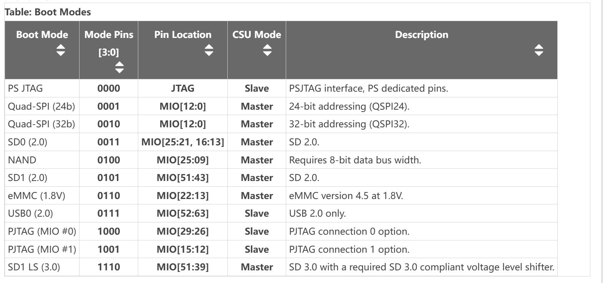
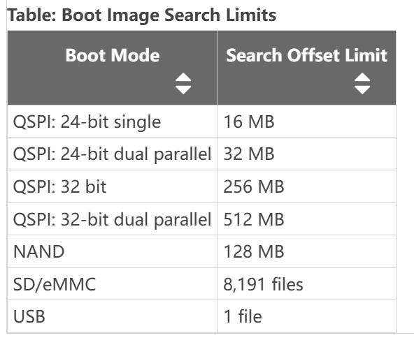
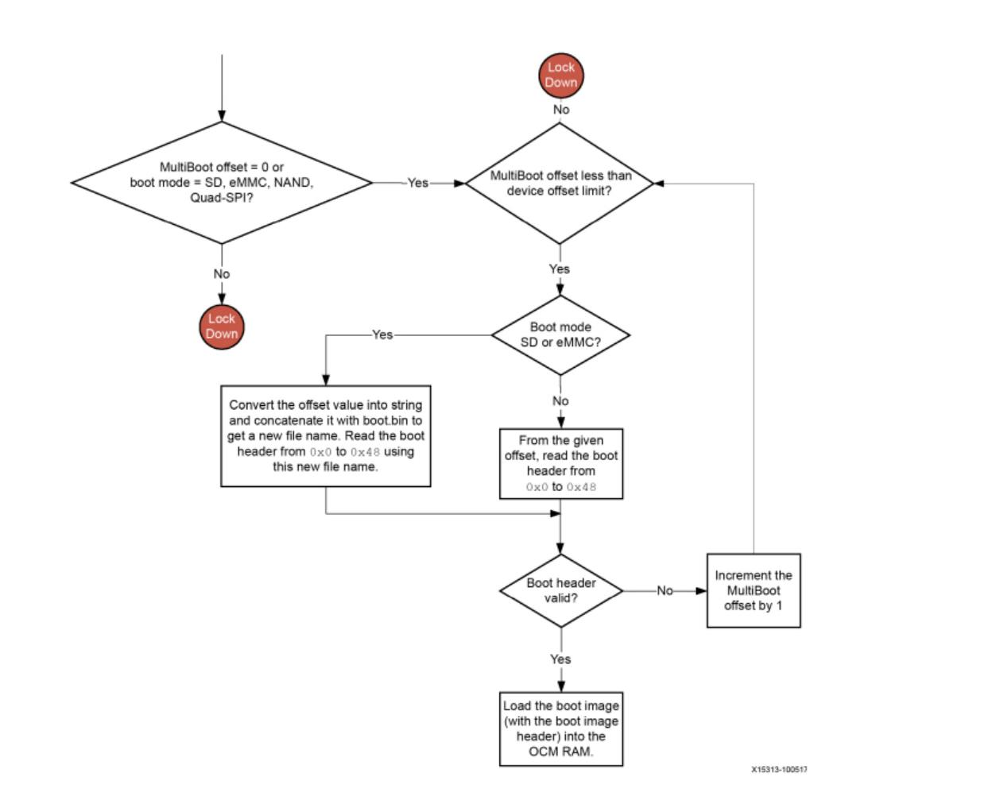
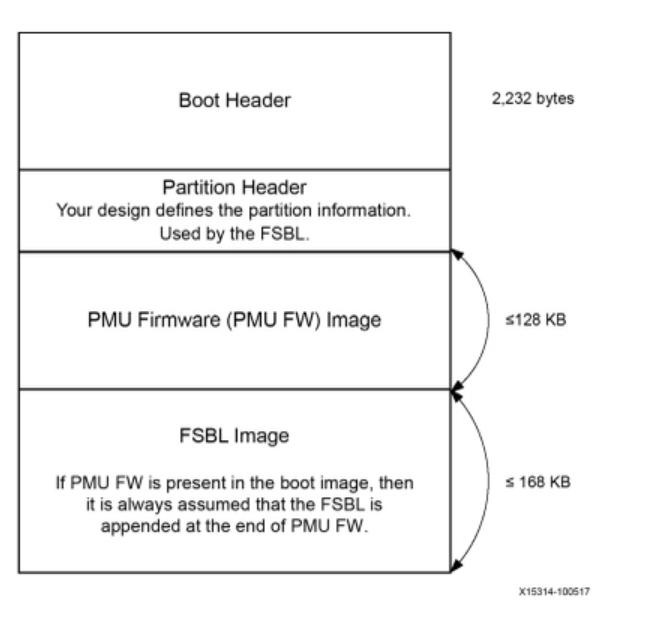
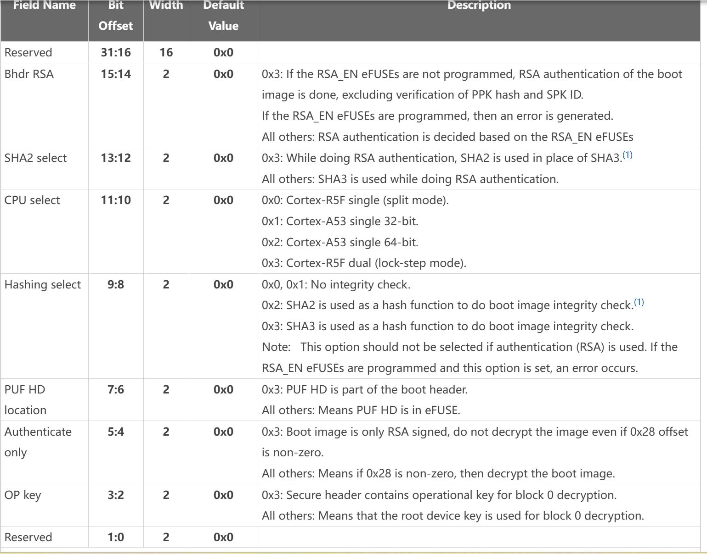

这里记录 ZynqMP 的启动和配置过程。

<!--more-->

# Overview

zynqmp 的启动及配置过程由 PMU（Platform management unit）和 CSU（configuration security unit）来管理，其大体上包含以下 3 个过程：

1. Pre-confituration stage：系统上电启动时会复位 CSU 和 PMU，PMU 会执行 PMU ROM Code 来设置系统。主要是用于基本的初始化和唤醒处理器。

2. Configuration stage：CSU ROM 会分析`boot.bin`的文件头，配置系统。然后将 FSBL 加载到内部的 on-chip RAM 执行安全或非安全启动。CSU 还会加载 PMU 用户固件（PMU FW）到 PMU RAM，用于对系统硬件进行管理配置。

3. Post-configuration stage：当 FSBL 开始执行后，CSU ROM 就会进入 post-configuration 阶段。这个阶段是 CSU 硬件提供对文件的校验、配置 PL 、解密等功能。

## 启动流程

PMU 启动时会执行一些必须和可选的流程：

- 清零低功耗域（LPD）寄存器（可选）：当 LPD_SC eFUSEs 被编程，则会执行该步骤

- 清零全功耗域（FPD）寄存器（可选）：当 FPD_SC eFUSEs 被编程，则会执行该步骤

- 清零 PMU RAM：先将 RAM 写 0 然后回读验证，以确保写入成功

- 清零 PMU 处理器的 TLB 内存

- 电压检测：PMU 会检查 LPD、AUX、专用 I/O 的电压，以确保可以正常工作

- 清零内存：PMU 会清零 CSU、LPD、FPD 的内存

PMU 的职责之一就是在硬件上电复位后，对系统各部分进行正确的上电，然后进入后台模式（管理其他部分的上电、睡眠、唤醒等），其上电复位后 PMU ROM code 执行流程为：

1. 初始化 PS SYSMON 单元以及 PLL

2. 清空 PMU RAM 和 CSU RAM

3. 检查 PLL 是否锁定

4. 通过 PS SYSMON 单元检查 LPD，AUX 以及 I/O 电压是否在正常范围内

5. 清空低功耗域以及全功耗域

6. 当以上步骤无误后，进入到 CSU 阶段，并且自己进入服务模式（如果 PMUFW 没有被使用，则 PMU 模块进入睡眠模式）

CSU 启动后，其执行流程为：

1. 初始化片内 RAM

2. PMU 在复位阶段获取到了启动引脚的配置，CSU 根据该配置来确定应该从哪里读取启动代码

3. CSU 将 FSBL 加载到片内 RAM 执行。

4. CSU 将 PMU FW 加载到 PMU RAM 进行执行

PMU FW 主要用于对硬件进行管理，它与 FSBL 进行结合使用。

CSU 主要用于加密和非加密的系统配置、密钥管理、PS/PL 编程接口等，它主要由以下两个部分组成：

1. 三重冗余的安全处理器

2. 加密接口，包括 AES、RSA、SHA3 等

## 启动模式

zynqmp 支持 multi-boot 搜寻，其搜寻范围如下：

那么很明显，在 QSPI 中，应该使用 32bit 模式以支持更大的范围。

## 启动代码的搜寻

CSU 运行 BootROM 来搜寻合法的 boot header 并运行启动代码，是根据搜寻头中是否有字符串`XLNX`来判断头的合法性。一旦找到该字符串，就会对头进行校验和。如果校验和成功则会从启动代码中载入 FSBL 到 OCM 执行。

启动代码存放的位置需要以 32KB 对齐，因为 BootROM 会以 32KB 的步进来搜寻合法的启动头。

在 FSBL 中，可以将备份的启动代码位置除以 32KB 写入`CSU.csu_multi_boot`寄存器，在热复位以后就可以从该寄存器获取地址然后乘以 32KB得到启动代码的位置。

如果该备份启动代码头不合法，则会通过常规的方式来查找合法的启动代码头。

# 启动镜像的结构

上图是普通启动镜像的结构，无论镜像是否加密，它们的`boot header`和`partition header`都是一样的。

## Boot Header Format

| 偏移          | 说明                          |
| ----------- | --------------------------- |
| 0x00~0x1C   | 为支持 XIP 方式的 Flash 而保留的中断向量表 |
| 0x20        | 指定 QSPI 的位宽                 |
| 0x24        | 启动镜像的头`XNLX`                |
| 0x28        | 加密状态                        |
| 0x2C        | FSBL 的执行地址                  |
| 0x30        | PMU FW 和 FSBL 的存放起始地址       |
| 0x34        | PMU FW 的原始镜像大小              |
| 0x38        | 总共 PMU FW 镜像的大小             |
| 0x3c        | FSBL 原始镜像大小                 |
| 0x40        | 总共 FSBL 镜像大小                |
| 0x44        | 镜像的属性                       |
| 0x48        | 头的检验和从 0x20~0x44            |
| 0x4c-0x68   | 混淆密钥，只在加密状态为A35C_7CA5h 才有效  |
| 0x6c        | 保留                          |
| 0x70~0x9c   | FSBL/User 定义                |
| 0xa0~0xa8   | 加密镜像的初始向量                   |
| 0xac~0xb4   |                             |
| 0xb8~0x8b4  | 系统寄存器的初始化值                  |
| 0x8b8~0xec0 | PUF 帮助数据                    |

## QSPI 的位宽判定

如果启动设备是 QSPI 的话，BootROM 会先以 X1 的方式读取启动镜像的头，如果地址`0x20`处的位宽值为`0xAA995566`，则表示 flash 位宽为 4 位位宽。然后 BootROM 会切换为 X4 模式读取镜像文件内容（如果 X4 失败了，则会依次尝试 X2、X1 模式）。

## 镜像文件的属性

