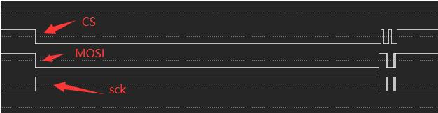

两个 stm32 通过 SPI 进行通信，一主一从，但从机不能使用 CubeMX 的默认配置，不然会被带进坑……

<!--more-->

# 遇到问题
目前我两个 stm32f4 芯片通过 SPI 进行主从通信，但从机获取的**第一帧**数据会丢失一个位，其配置如下：

主机：
- CPOL = 0，CPHA = 0
- 软件片选

从机：
- CPOL = 0，CPHA = 0
- 硬件片选

其现象如下：
- 当主机启动，第一次发送 `0xA5` 时，从机会接收到`0xD2`
- 当主机启动，第一次发送 `0x53` 时，从机会接收到`0x29`

经过二进制对比可以发现：从机接收到的数据相比主机右移了一位，也就是说**从机相比主机更早的接收到了一个时钟**。

# 排查
要找到这个问题，首先就需要缩小范围，判断是主机的问题还是从机的问题。

逻辑分析仪抓取主机发送时序如下：


可以看到，SCK 在 MOSI 发送数据前，居然被拉高了！
> 前面的配置中，CPOL = 0，那么此时 SCK 应该保持低电平才对。

那可以猜想：从机判断 SCK 拉高了，误认为这是一个信号，所以从机会比主机提前接收一个 bit。

# 解决

有以下几种解决办法：

## 配置管脚状态

既然主机会莫名其妙的提前将 SCK 拉高，那么我们在从机端也可以将 SCK 管脚配置为 `GPIO_PULLDOWN` 模式（默认 CubeMX 生成的代码是 `GPIO_NOPULL`）：
```cpp
    // SCK Pin should be pulled down when CPOL = 0
    GPIO_InitStruct.Pin = GPIO_PIN_3;
    GPIO_InitStruct.Mode = GPIO_MODE_AF_PP;
    GPIO_InitStruct.Pull = GPIO_PULLDOWN;
    GPIO_InitStruct.Speed = GPIO_SPEED_FREQ_VERY_HIGH;
    GPIO_InitStruct.Alternate = GPIO_AF5_SPI1;
    HAL_GPIO_Init(GPIOB, &GPIO_InitStruct);
```
经测试，这下就可以正常稳定的通信了。

在解决后，我尝试搜索是否别人也遇到了这个问题，还是我这个是个例。

最终发送在[stackexchange](https://electronics.stackexchange.com/questions/492271/stm32f4-spi-communication-fails-when-polarity-is-low) 上也遇到了同样的问题，而且其逻辑分析仪结果与我的一致，看来这个是 ST 的锅了……

## 配置时钟极性

既然主机会莫名其妙的提前将 SCK 拉高，那么我们也可以将主从机 SCK 极性配置为高，已掩盖掉此问题：
```cpp
  hspi3.Instance = SPI3;
  hspi3.Init.Mode = SPI_MODE_MASTER;
  hspi3.Init.Direction = SPI_DIRECTION_2LINES;
  hspi3.Init.DataSize = SPI_DATASIZE_8BIT;
  hspi3.Init.CLKPolarity = SPI_POLARITY_HIGH;//SPI_POLARITY_HIGH;//SPI_POLARITY_LOW;
  hspi3.Init.CLKPhase = SPI_PHASE_1EDGE;//SPI_PHASE_1EDGE;
  hspi3.Init.NSS = SPI_NSS_SOFT;
  hspi3.Init.BaudRatePrescaler = SPI_BAUDRATEPRESCALER_256;
  hspi3.Init.FirstBit = SPI_FIRSTBIT_MSB;
  hspi3.Init.TIMode = SPI_TIMODE_DISABLE;
  hspi3.Init.CRCCalculation = SPI_CRCCALCULATION_DISABLE;
  hspi3.Init.CRCPolynomial = 10;
  if (HAL_SPI_Init(&hspi3) != HAL_OK)
  {
    Error_Handler();
  }
```
这个经过测试，也是可以稳定通信的。